# QuantMate 详细架构设计文档

> **版本**: V1.0  
> **创建日期**: 2026-03-16  
> **文档状态**: 正式版  
> **维护者**: QuantMate Team  
> **关联文档**: [产品需求规格文档 (PRD)](../requirements/PRODUCT_REQUIREMENTS_V1.md)

---

## 目录

- [1. 系统架构总览](#1-系统架构总览)
  - [1.1 架构愿景](#11-架构愿景)
  - [1.2 C4 架构视图](#12-c4-架构视图)
  - [1.3 技术栈总结](#13-技术栈总结)
  - [1.4 服务拓扑](#14-服务拓扑)
  - [1.5 数据流全景](#15-数据流全景)
- [2. 后端分层架构](#2-后端分层架构)
  - [2.1 分层概述](#21-分层概述)
  - [2.2 API 层](#22-api-层)
  - [2.3 Domain 层](#23-domain-层)
  - [2.4 DAO 层](#24-dao-层)
  - [2.5 Infrastructure 层](#25-infrastructure-层)
  - [2.6 跨层调用规则](#26-跨层调用规则)
- [3. 前端架构](#3-前端架构)
  - [3.1 技术选型](#31-技术选型)
  - [3.2 路由结构](#32-路由结构)
  - [3.3 状态管理](#33-状态管理)
  - [3.4 API 客户端与拦截器](#34-api-客户端与拦截器)
  - [3.5 组件层次](#35-组件层次)
  - [3.6 数据流模式](#36-数据流模式)
- [4. 数据库架构](#4-数据库架构)
  - [4.1 分库策略](#41-分库策略)
  - [4.2 ER 关系图](#42-er-关系图)
  - [4.3 核心业务库 quantmate](#43-核心业务库-quantmate)
  - [4.4 市场数据库 tushare](#44-市场数据库-tushare)
  - [4.5 辅助数据库 akshare](#45-辅助数据库-akshare)
  - [4.6 交易引擎库 vnpy](#46-交易引擎库-vnpy)
  - [4.7 AI 模型库 qlib](#47-ai-模型库-qlib)
  - [4.8 待建设表清单](#48-待建设表清单)
  - [4.9 索引与优化策略](#49-索引与优化策略)
- [5. 数据同步架构](#5-数据同步架构)
  - [5.1 DataSync Daemon 总体设计](#51-datasync-daemon-总体设计)
  - [5.2 数据源适配层](#52-数据源适配层)
  - [5.3 同步生命周期](#53-同步生命周期)
  - [5.4 速率限制机制](#54-速率限制机制)
  - [5.5 断点续传](#55-断点续传)
  - [5.6 数据项开关管理](#56-数据项开关管理)
  - [5.7 数据质量保障](#57-数据质量保障)
- [6. API 接口设计](#6-api-接口设计)
  - [6.1 设计原则](#61-设计原则)
  - [6.2 已实现接口](#62-已实现接口)
  - [6.3 Pydantic 请求/响应模型](#63-pydantic-请求响应模型)
  - [6.4 待建设接口](#64-待建设接口)
  - [6.5 错误码体系](#65-错误码体系)
  - [6.6 版本策略](#66-版本策略)
- [7. 异步任务架构](#7-异步任务架构)
  - [7.1 RQ Worker 设计](#71-rq-worker-设计)
  - [7.2 队列拓扑](#72-队列拓扑)
  - [7.3 任务生命周期](#73-任务生命周期)
  - [7.4 任务实现](#74-任务实现)
  - [7.5 Redis 数据结构](#75-redis-数据结构)
  - [7.6 Worker 扩展策略](#76-worker-扩展策略)
- [8. 安全架构](#8-安全架构)
  - [8.1 认证流程](#81-认证流程)
  - [8.2 JWT 双令牌机制](#82-jwt-双令牌机制)
  - [8.3 密码安全](#83-密码安全)
  - [8.4 RBAC 权限模型（目标）](#84-rbac-权限模型目标)
  - [8.5 Web 安全防护](#85-web-安全防护)
  - [8.6 数据安全](#86-数据安全)
- [9. 部署架构](#9-部署架构)
  - [9.1 三环境拓扑](#91-三环境拓扑)
  - [9.2 容器服务配置](#92-容器服务配置)
  - [9.3 Nginx 路由规则](#93-nginx-路由规则)
  - [9.4 环境变量管理](#94-环境变量管理)
  - [9.5 健康检查](#95-健康检查)
  - [9.6 备份与恢复策略](#96-备份与恢复策略)
  - [9.7 CI/CD 流水线](#97-cicd-流水线)
- [10. AI 集成架构](#10-ai-集成架构)
  - [10.1 AI 场景总览](#101-ai-场景总览)
  - [10.2 LLM 集成链路](#102-llm-集成链路)
  - [10.3 代码沙箱安全](#103-代码沙箱安全)
  - [10.4 模型管理](#104-模型管理)
  - [10.5 Qlib 量化因子 & ML 集成](#105-qlib-量化因子--ml-集成)
  - [10.6 VNPy 实盘交易架构](#106-vnpy-实盘交易架构)
- [11. 监控与可观测性](#11-监控与可观测性)
  - [11.1 日志体系](#111-日志体系)
  - [11.2 健康检查端点](#112-健康检查端点)
  - [11.3 指标与仪表盘](#113-指标与仪表盘)
  - [11.4 告警链路](#114-告警链路)
- [附录](#附录)
  - [A. 术语表](#a-术语表)
  - [B. 决策记录 (ADR)](#b-决策记录-adr)

---

## 1. 系统架构总览

### 1.1 架构愿景

QuantMate 采用 **三层服务 + 多库分离** 的架构设计，核心设计原则：

| 原则 | 说明 |
|------|------|
| **关注点分离** | 前端/API/Worker/DataSync 独立服务，各司其职 |
| **领域驱动分层** | 后端按 API→Domain→DAO→Infrastructure 四层分离 |
| **多库隔离** | 业务数据(quantmate)与市场数据(tushare/akshare)、交易(vnpy)、AI模型(qlib)物理分离 |
| **异步解耦** | 耗时任务（回测/优化）通过 RQ 消息队列解耦 |
| **配置外置** | 全部配置通过环境变量注入，不硬编码 |
| **容器化部署** | Docker Compose 统一编排，dev/staging/prod 三环境 |

### 1.2 C4 架构视图

#### Level 1: System Context

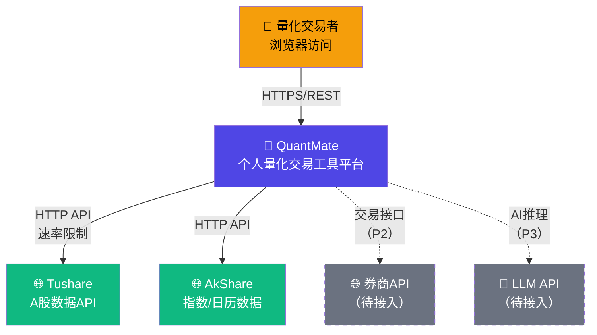
```mermaid
graph TB
    User["👤 量化交易者<br/>浏览器访问"]
    
    QM["🏢 QuantMate<br/>个人量化交易工具平台"]
    
    Tushare["🌐 Tushare<br/>A股数据API"]
    AkShare["🌐 AkShare<br/>指数/日历数据"]
    Broker["🌐 券商API<br/>（待接入）"]
    LLM["🤖 LLM API<br/>（待接入）"]
    
    User -->|"HTTPS/REST"| QM
    QM -->|"HTTP API<br/>速率限制"| Tushare
    QM -->|"HTTP API"| AkShare
    QM -.->|"交易接口<br/>（P2）"| Broker
    QM -.->|"AI推理<br/>（P3）"| LLM
    
    style QM fill:#4f46e5,color:#fff
    style User fill:#f59e0b,color:#000
    style Tushare fill:#10b981,color:#fff
    style AkShare fill:#10b981,color:#fff
    style Broker fill:#6b7280,color:#fff,stroke-dasharray: 5 5
    style LLM fill:#6b7280,color:#fff,stroke-dasharray: 5 5
```

#### Level 2: Container Diagram

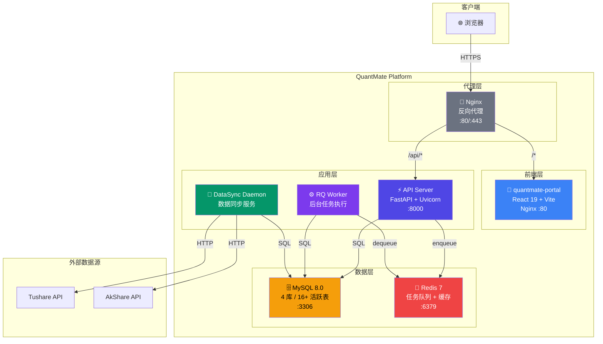
```mermaid
graph TB
    subgraph "客户端"
        Browser["🌐 浏览器"]
    end
    
    subgraph "QuantMate Platform"
        subgraph "前端层"
            Portal["📱 quantmate-portal<br/>React 19 + Vite<br/>Nginx :80"]
        end
        
        subgraph "代理层"
            Nginx["🔀 Nginx<br/>反向代理<br/>:80/:443"]
        end
        
        subgraph "应用层"
            API["⚡ API Server<br/>FastAPI + Uvicorn<br/>:8000"]
            Worker["⚙️ RQ Worker<br/>后台任务执行"]
            DataSync["🔄 DataSync Daemon<br/>数据同步服务"]
        end
        
        subgraph "数据层"
            MySQL["🗄️ MySQL 8.0<br/>4 库 / 16+ 活跃表<br/>:3306"]
            Redis["📮 Redis 7<br/>任务队列 + 缓存<br/>:6379"]
        end
    end
    
    subgraph "外部数据源"
        TS["Tushare API"]
        AK["AkShare API"]
    end
    
    Browser -->|"HTTPS"| Nginx
    Nginx -->|"/api/*"| API
    Nginx -->|"/*"| Portal
    API -->|"SQL"| MySQL
    API -->|"enqueue"| Redis
    Worker -->|"dequeue"| Redis
    Worker -->|"SQL"| MySQL
    DataSync -->|"SQL"| MySQL
    DataSync -->|"HTTP"| TS
    DataSync -->|"HTTP"| AK
    
    style API fill:#4f46e5,color:#fff
    style Worker fill:#7c3aed,color:#fff
    style DataSync fill:#059669,color:#fff
    style MySQL fill:#f59e0b,color:#000
    style Redis fill:#ef4444,color:#fff
    style Portal fill:#3b82f6,color:#fff
    style Nginx fill:#6b7280,color:#fff
```

#### Level 3: Component Diagram（后端）

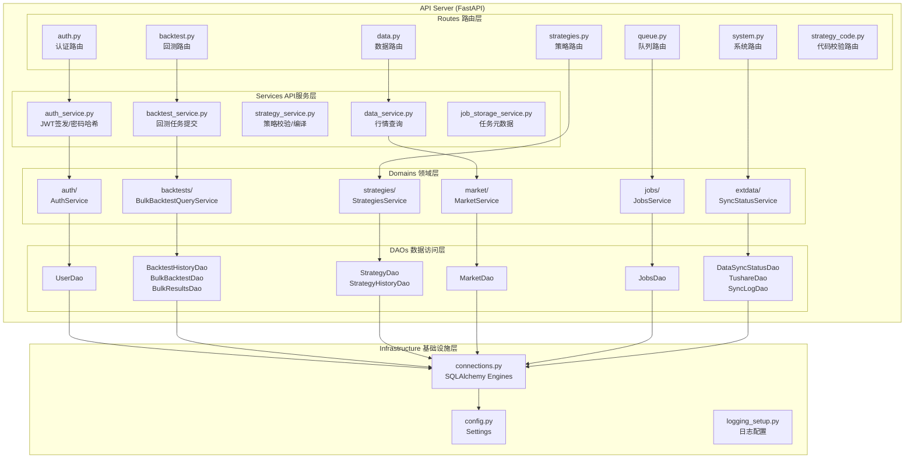
```mermaid
graph TB
    subgraph "API Server (FastAPI)"
        subgraph "Routes 路由层"
            R_Auth["auth.py<br/>认证路由"]
            R_Strat["strategies.py<br/>策略路由"]
            R_BT["backtest.py<br/>回测路由"]
            R_Data["data.py<br/>数据路由"]
            R_Queue["queue.py<br/>队列路由"]
            R_Sys["system.py<br/>系统路由"]
            R_Code["strategy_code.py<br/>代码校验路由"]
        end
        
        subgraph "Services API服务层"
            S_Auth["auth_service.py<br/>JWT签发/密码哈希"]
            S_BT["backtest_service.py<br/>回测任务提交"]
            S_Strat["strategy_service.py<br/>策略校验/编译"]
            S_Data["data_service.py<br/>行情查询"]
            S_Job["job_storage_service.py<br/>任务元数据"]
        end
        
        subgraph "Domains 领域层"
            D_Auth["auth/<br/>AuthService"]
            D_BT["backtests/<br/>BulkBacktestQueryService"]
            D_Strat["strategies/<br/>StrategiesService"]
            D_Market["market/<br/>MarketService"]
            D_Jobs["jobs/<br/>JobsService"]
            D_Ext["extdata/<br/>SyncStatusService"]
        end
        
        subgraph "DAOs 数据访问层"
            DA_User["UserDao"]
            DA_BT["BacktestHistoryDao<br/>BulkBacktestDao<br/>BulkResultsDao"]
            DA_Strat["StrategyDao<br/>StrategyHistoryDao"]
            DA_Market["MarketDao"]
            DA_Jobs["JobsDao"]
            DA_Sync["DataSyncStatusDao<br/>TushareDao<br/>SyncLogDao"]
        end
    end
    
    subgraph "Infrastructure 基础设施层"
        Conf["config.py<br/>Settings"]
        DB["connections.py<br/>SQLAlchemy Engines"]
        Log["logging_setup.py<br/>日志配置"]
    end
    
    R_Auth --> S_Auth --> D_Auth --> DA_User
    R_Strat --> D_Strat --> DA_Strat
    R_BT --> S_BT --> D_BT --> DA_BT
    R_Data --> S_Data --> D_Market --> DA_Market
    R_Queue --> D_Jobs --> DA_Jobs
    R_Sys --> D_Ext --> DA_Sync
    
    DA_User --> DB
    DA_BT --> DB
    DA_Strat --> DB
    DA_Market --> DB
    DA_Jobs --> DB
    DA_Sync --> DB
    DB --> Conf
```

### 1.3 技术栈总结

#### 后端技术栈

| 类别 | 技术 | 版本 | 用途 |
|------|------|------|------|
| Web 框架 | FastAPI | Latest | 异步 REST API |
| ASGI 服务器 | Uvicorn | Latest | HTTP 服务 |
| 数据库 ORM | SQLAlchemy | Latest | 数据库连接 & Raw SQL |
| 数据处理 | Pandas / NumPy | Latest | 行情数据处理 |
| 量化引擎 | VNPy | 4.3.0 | CTA 回测 + 实盘交易引擎 |
| CTA 策略 | vnpy_ctastrategy | Latest | CTA 策略回测与自动化执行 |
| 期货网关 | vnpy_ctp | Latest | CTP 期货接口（CFFEX/SHFE/DCE/CZCE/INE） |
| 股票网关 | vnpy_xtp | Latest | XTP 股票接口（SSE/SZSE） |
| AI 模型 | pyqlib (Microsoft Qlib) | ≥0.9.0 | 量化因子研究 + 模型训练/预测 |
| 科学计算 | scipy | ≥1.10.0 | Qlib 模型依赖 |
| 辅助引擎 | BackTrader | Latest | 回测辅助 |
| 技术指标 | TA-Lib | Latest | 技术指标计算 |
| 优化算法 | DEAP | Latest | 遗传算法参数优化 |
| 认证 | PyJWT + bcrypt | Latest | JWT签发 + 密码哈希 |
| 任务队列 | RQ (Redis Queue) | Latest | 异步任务调度 |
| 定时调度 | schedule | Latest | DataSync 定时触发 |
| 数据源 | tushare / akshare | Latest | A股行情数据 |
| 数据库驱动 | PyMySQL | Latest | MySQL 连接 |
| 缓存 | redis-py | Latest | Redis 客户端 |

#### 前端技术栈

| 类别 | 技术 | 版本 | 用途 |
|------|------|------|------|
| UI 框架 | React | 19 | 组件化 UI |
| 语言 | TypeScript | 5.9 | 类型安全 |
| 构建工具 | Vite | 7 | 开发/构建 |
| 状态管理 | Zustand | 5 | 轻量级全局状态 |
| 数据获取 | TanStack React Query | 5 | 服务端数据缓存 |
| 路由 | React Router | 7 | SPA 路由 |
| HTTP 客户端 | Axios | Latest | API 调用 |
| 图表 | Recharts | 3 | 数据可视化 |
| 代码编辑器 | Monaco Editor | Latest | 策略代码编辑 |
| CSS 框架 | Tailwind CSS | 3 | 原子化样式 |
| 图标 | Lucide React | Latest | UI 图标 |
| E2E 测试 | Playwright | Latest | 端到端测试 |
| 单元测试 | Vitest | Latest | 组件/逻辑测试 |

#### 数据层技术栈

| 类别 | 技术 | 版本 | 用途 |
|------|------|------|------|
| 关系数据库 | MySQL | 8.0 | 持久化存储（5 库：quantmate/tushare/akshare/vnpy/qlib） |
| 内存数据库 | Redis | 7 | 任务队列 + 元数据缓存 |

#### 部署技术栈

| 类别 | 技术 | 用途 |
|------|------|------|
| 容器化 | Docker + Docker Compose | 服务编排 |
| 反向代理 | Nginx | 路由 + 静态资源 |
| 镜像仓库 | GitHub Container Registry | 镜像托管 |
| 版本控制 | Git + GitHub | 源码管理 |

### 1.4 服务拓扑

系统由 7 个容器服务组成：

| 服务 | 容器名 | 端口 | 职责 | 资源限制 |
|------|--------|------|------|----------|
| **API Server** | `api` | 8000 | FastAPI 应用，处理所有 HTTP 请求 | — |
| **RQ Worker** | `worker` | — | 执行回测/优化等耗时任务 | 1GB RAM |
| **DataSync Daemon** | `datasync` | — | 定时数据同步（Tushare + AkShare） | — |
| **MySQL** | `mysql` | 3306 | 持久化存储（5 个逻辑数据库） | — |
| **Redis** | `redis` | 6379 | 任务队列 + 任务元数据缓存 | — |
| **Portal** | `portal` | 80 | React 前端（Nginx 托管静态文件） | — |
| **Nginx** | `nginx` | 80/443 | 反向代理，统一入口 | — |

**服务依赖关系**：

```
API      → MySQL, Redis
Worker   → MySQL, Redis
DataSync → MySQL（直连外部 API）
Portal   → 独立（通过 Nginx 路由到 API）
Nginx    → API, Portal
```

### 1.5 数据流全景

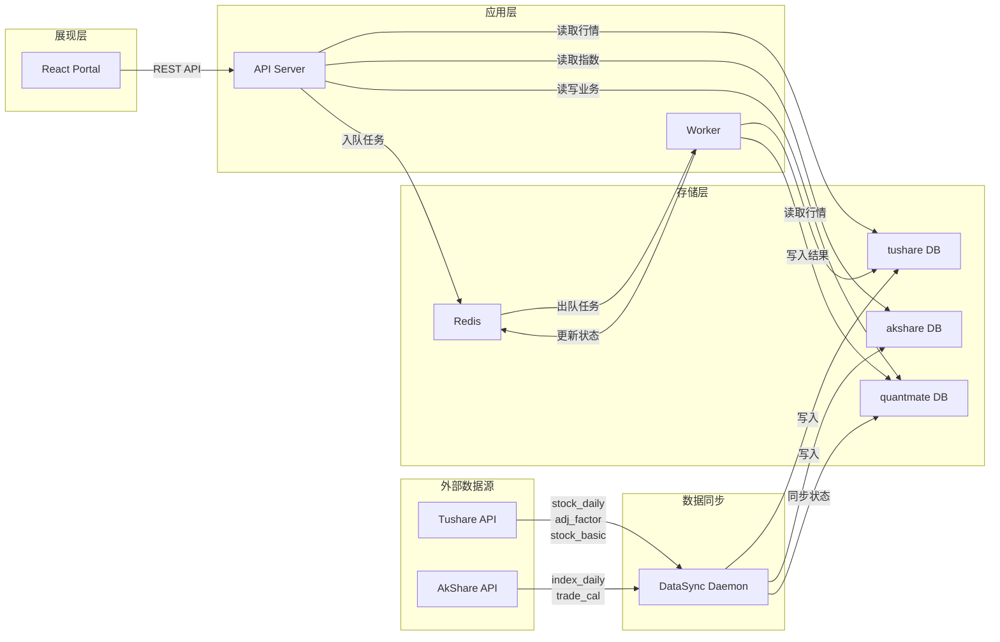
```mermaid
graph LR
    subgraph "外部数据源"
        TS["Tushare API"]
        AK["AkShare API"]
    end
    
    subgraph "数据同步"
        DS["DataSync Daemon"]
    end
    
    subgraph "存储层"
        M_TS["tushare DB"]
        M_AK["akshare DB"]
        M_QM["quantmate DB"]
        RD["Redis"]
    end
    
    subgraph "应用层"
        API["API Server"]
        WK["Worker"]
    end
    
    subgraph "展现层"
        FE["React Portal"]
    end
    
    TS -->|"stock_daily<br/>adj_factor<br/>stock_basic"| DS
    AK -->|"index_daily<br/>trade_cal"| DS
    DS -->|"写入"| M_TS
    DS -->|"写入"| M_AK
    DS -->|"同步状态"| M_QM

    FE -->|"REST API"| API
    API -->|"读取行情"| M_TS
    API -->|"读取指数"| M_AK
    API -->|"读写业务"| M_QM
    API -->|"入队任务"| RD
    
    RD -->|"出队任务"| WK
    WK -->|"读取行情"| M_TS
    WK -->|"写入结果"| M_QM
    WK -->|"更新状态"| RD
```

**核心数据流说明**：

| 数据流 | 路径 | 说明 |
|--------|------|------|
| **行情同步** | Tushare/AkShare → DataSync → MySQL(tushare/akshare) | 每日 02:00 自动同步，支持断点续传 |
| **行情查询** | Portal → API → MySQL(tushare) → Portal | 用户查看K线/指标/市场概览 |
| **策略管理** | Portal → API → MySQL(quantmate) → Portal | 策略 CRUD + 版本管理 |
| **回测提交** | Portal → API → Redis(enqueue) → Worker → MySQL(quantmate) | 异步执行，前端 5s 轮询状态 |
| **结果获取** | Portal → API → MySQL(quantmate) + Redis(meta) → Portal | 回测完成后读取结果并渲染 |

---

## 2. 后端分层架构

### 2.1 分层概述

后端采用 **四层分层架构 + 领域驱动设计 (DDD)**，严格分离关注点：

```
┌─────────────────────────────────────────────────────────────┐
│  API Layer (app/api/)                                       │
│  FastAPI 路由 + 请求/响应模型 + API 级服务                    │
├─────────────────────────────────────────────────────────────┤
│  Domain Layer (app/domains/)                                │
│  业务逻辑 + 领域服务 + 业务规则校验                           │
├─────────────────────────────────────────────────────────────┤
│  DAO Layer (app/domains/*/dao/)                             │
│  数据访问对象 + SQL 查询 + 数据映射                           │
├─────────────────────────────────────────────────────────────┤
│  Infrastructure Layer (app/infrastructure/)                  │
│  配置管理 + 数据库连接 + 日志 + 跨切面                        │
└─────────────────────────────────────────────────────────────┘
```

**目录结构映射**：

```
app/
├── api/                           # API 层
│   ├── main.py                    # FastAPI 入口 (lifespan + middleware + routes)
│   ├── routes/                    # 7 个路由模块
│   │   ├── auth.py                # 认证路由 (5 endpoints)
│   │   ├── strategies.py          # 策略路由 (6 endpoints)
│   │   ├── backtest.py            # 回测路由 (3+ endpoints)
│   │   ├── data.py                # 数据路由 (4 endpoints)
│   │   ├── queue.py               # 队列路由 (6 endpoints)
│   │   ├── system.py              # 系统路由
│   │   └── strategy_code.py       # 代码校验路由
│   ├── models/                    # Pydantic 请求/响应模型
│   │   ├── user.py                # UserCreate, UserLogin, Token, TokenData
│   │   ├── backtest.py            # BacktestRequest, BacktestResult
│   │   └── strategy.py            # StrategyCreate, Strategy
│   └── services/                  # API 级服务（编排层）
│       ├── auth_service.py        # JWT 签发/验证, 密码哈希
│       ├── backtest_service.py    # 回测任务提交 (RQ 集成)
│       ├── strategy_service.py    # 策略编译/校验
│       ├── data_service.py        # 行情数据查询
│       └── job_storage_service.py # 任务元数据管理
│
├── domains/                       # Domain 层 (6 个领域)
│   ├── auth/                      # 认证领域
│   │   ├── service.py             # AuthService
│   │   └── dao/user_dao.py        # UserDao
│   ├── backtests/                 # 回测领域
│   │   ├── service.py             # BulkBacktestQueryService
│   │   └── dao/
│   │       ├── backtest_history_dao.py
│   │       ├── bulk_backtest_dao.py
│   │       ├── bulk_results_dao.py
│   │       ├── akshare_benchmark_dao.py
│   │       └── strategy_source_dao.py
│   ├── strategies/                # 策略领域
│   │   ├── service.py             # StrategiesService
│   │   └── dao/
│   │       ├── strategy_dao.py
│   │       └── strategy_history_dao.py
│   ├── market/                    # 行情领域
│   │   ├── service.py             # MarketService
│   │   └── dao/market_dao.py
│   ├── jobs/                      # 任务领域
│   │   ├── service.py             # JobsService
│   │   └── dao/jobs_dao.py
│   └── extdata/                   # 外部数据领域
│       ├── service.py             # SyncStatusService
│       └── dao/
│           ├── data_sync_status_dao.py
│           ├── tushare_dao.py
│           └── sync_log_dao.py
│
├── infrastructure/                # Infrastructure 层
│   ├── config/config.py           # Settings 类 (环境变量映射)
│   ├── db/connections.py          # SQLAlchemy 引擎 + 连接管理
│   └── logging/logging_setup.py   # 日志配置
│
├── datasync/                      # DataSync 独立服务
│   ├── main.py                    # 入口
│   ├── metrics.py                 # 同步指标
│   └── service/
│       ├── data_sync_daemon.py    # 调度主循环
│       ├── tushare_ingest.py      # Tushare 适配 (call_ts)
│       ├── akshare_ingest.py      # AkShare 适配 (call_ak)
│       └── vnpy_ingest.py         # VNPy 数据转换
│
├── worker/                        # Worker 独立服务
│   ├── main.py                    # 入口
│   └── service/
│       ├── run_worker.py          # Worker CLI 启动
│       ├── config.py              # Redis + 队列配置
│       └── tasks.py               # 任务实现
│
├── strategies/                    # 内置策略库
│   ├── macd_strategy.py           # MACD 策略
│   ├── triple_ma_strategy.py      # 三均线策略
│   ├── turtle_trading.py          # 海龟交易策略
│   └── stop_loss.py               # 止损管理
│
└── utils/
    └── ts_utils.py                # 技术指标工具函数
```

**文件统计**：

| 模块 | Python 文件 | DAO 文件 | Service 文件 | Route 文件 |
|------|------------|---------|-------------|-----------|
| api/ | 8 | 0 | 5 | 7 |
| domains/ | 20+ | 13+ | 6 | 0 |
| infrastructure/ | 3 | 0 | 0 | 0 |
| datasync/ | 6 | 0 | 1 | 0 |
| worker/ | 4 | 0 | 1 | 0 |
| strategies/ | 4 | 0 | 0 | 0 |
| utils/ | 1 | 0 | 0 | 0 |
| **合计** | **46+** | **13+** | **13** | **7** |

### 2.2 API 层

#### 2.2.1 FastAPI 应用入口

`app/api/main.py` 是整个 API 服务的入口，负责：

1. **Lifespan 管理** — 启动时初始化数据库连接、自动创建管理员账户；关闭时释放连接
2. **中间件注册** — CORS 跨域配置（`CORS_ORIGINS` 环境变量）
3. **全局依赖** — `ensure_password_changed()` 确保用户首次登录必须改密
4. **路由注册** — 挂载 7 个路由模块到 `/api` 前缀

```python
# 路由注册结构（各子路由自带前缀，main.py 统一挂载到 /api）
app.include_router(auth_router,      prefix="/api")  # → /api/auth/*
app.include_router(strategies_router, prefix="/api")  # → /api/strategies/*
app.include_router(backtest_router,   prefix="/api")  # → /api/backtest/*
app.include_router(data_router,       prefix="/api")  # → /api/data/*
app.include_router(queue_router,      prefix="/api")  # → /api/queue/*
app.include_router(system_router,     prefix="/api")  # → /api/system/*
app.include_router(code_router,       prefix="/api")  # → /api/strategy-code/*
```

#### 2.2.2 路由模块

每个路由模块职责单一，仅处理 HTTP 请求/响应转换，业务逻辑委托给 Domain 层或 API Service 层：

| 路由模块 | 前缀 | 端点数 | 职责 |
|----------|------|--------|------|
| `auth.py` | `/api/auth` | 5 | 注册/登录/刷新/用户信息/改密 |
| `strategies.py` | `/api/strategies` | 6 | 策略 CRUD + 校验 |
| `backtest.py` | `/api/backtest` | 3+ | 单次/批量回测提交 + 结果查询 |
| `data.py` | `/api/data` | 4 | 标的搜索/K线/指标/概览 |
| `queue.py` | `/api/queue` | 6 | 队列统计/任务列表/取消/删除 |
| `system.py` | `/api/system` | 1+ | 同步状态/健康检查 |
| `strategy_code.py` | `/api/strategy-code` | 2 | 代码 Lint/解析 |
| `trading.py` | `/api/v1/trade` | 11+ | 实盘交易（订单/网关/CTA 策略） |
| `paper_trading.py` | `/api/v1/paper-trade` | 8 | 模拟交易（部署/订单/持仓/绩效） |

#### 2.2.3 API Service 层

API Service 层位于 routes 和 domains 之间，主要处理**跨领域编排**和**技术集成**（如 JWT、RQ）：

| 服务 | 文件 | 关键方法 | 职责 |
|------|------|---------|------|
| _(函数模块)_ | `auth_service.py` | `create_access_token()`, `create_refresh_token()`, `decode_token()`, `verify_password()`, `get_password_hash()` | JWT 签发/验证，密码哈希 |
| `BacktestServiceV2` | `backtest_service.py` | `submit_backtest()`, `submit_batch()` | 回测任务入队 RQ |
| _(函数模块)_ | `strategy_service.py` | `validate_strategy_code()`, `parse_strategy_file()` | Python AST 校验 + 解析 |
| `DataService` | `data_service.py` | `get_symbols()`, `get_history()`, `get_indicators()` | 行情数据查询编排 |
| `JobStorageService` | `job_storage_service.py` | `store_meta()`, `get_meta()` | Redis 任务元数据管理 |

### 2.3 Domain 层

Domain 层是**业务逻辑的核心**，每个领域（Domain）封装独立的业务规则：

| 领域 | Service 类 | 关键方法 | DAO 依赖 |
|------|-----------|---------|---------|
| **auth** | `AuthService` | `register()`, `login()`, `refresh()`, `me()`, `change_password()` | `UserDao` |
| **backtests** | `BulkBacktestQueryService` | `get_results_page()` (分页聚合) | `BacktestHistoryDao`, `BulkBacktestDao`, `BulkResultsDao`, `AkshareBenchmarkDao`, `StrategySourceDao` |
| **strategies** | `StrategiesService` | `list_strategies()`, `create_strategy()`, `get_strategy()`, `update_strategy()`, `delete_strategy()` | `StrategyDao`, `StrategyHistoryDao` |
| **market** | `MarketService` | `resolve_symbol_name()`, `market_overview()` | `MarketDao` |
| **jobs** | `JobsService` | `list_jobs()`, `delete_job_and_results()` | `JobsDao` |
| **extdata** | `SyncStatusService` | `get_sync_status()` | `SyncLogDao` |
| **trading** | `VnpyTradingService` | `connect_gateway()`, `disconnect_gateway()`, `submit_order()`, `list_gateways()` | Direct vnpy `MainEngine` |
| **trading** | `CtaStrategyRunner` | `start_strategy()`, `stop_strategy()`, `list_strategies()` | Direct vnpy `CtaEngine` |
| **paper_trading** | `PaperTradingService` | `deploy()`, `list_deployments()`, `stop_deployment()`, `get_positions()`, `get_performance()` | `paper_deployments` + `orders` (mode=paper) |
| **ai** | `QlibModelService` | `train_model()`, `get_predictions()`, `list_training_runs()` | qlib DB (via `get_qlib_connection()`) |

### 2.4 DAO 层

DAO（Data Access Object）层封装全部数据库操作，使用 SQLAlchemy 引擎执行参数化 SQL：

**核心 DAO 列表**：

| DAO 类 | 文件 | 目标表 | 关键操作 |
|--------|------|--------|---------|
| `UserDao` | `auth/dao/user_dao.py` | `users` | `username_exists()`, `email_exists()`, `insert_user()`, `get_by_username()` |
| `StrategyDao` | `strategies/dao/strategy_dao.py` | `strategies` | CRUD + 按用户查询 |
| `StrategyHistoryDao` | `strategies/dao/strategy_history_dao.py` | `strategy_versions` | 版本快照 + 恢复 |
| `BacktestHistoryDao` | `backtests/dao/backtest_history_dao.py` | `backtests` | 单次回测结果读写 |
| `BulkBacktestDao` | `backtests/dao/bulk_backtest_dao.py` | `batch_backtests` | 批量任务管理 |
| `BulkResultsDao` | `backtests/dao/bulk_results_dao.py` | `batch_backtest_tasks` | 子任务结果 |
| `AkshareBenchmarkDao` | `backtests/dao/akshare_benchmark_dao.py` | `akshare.stock_zh_index_daily` | 沪深300基准数据 |
| `StrategySourceDao` | `backtests/dao/strategy_source_dao.py` | `strategy_versions` | 回测关联策略代码 |
| `MarketDao` | `market/dao/market_dao.py` | `tushare.stock_daily` 等 | 标的搜索/K线/指标 |
| `JobsDao` | `jobs/dao/jobs_dao.py` | _Redis meta_ | 任务生命周期 |
| `DataSyncStatusDao` | `extdata/dao/data_sync_status_dao.py` | `sync_tracking` | 同步状态 + 交易日缓存 |
| `TushareDao` | `extdata/dao/tushare_dao.py` | `tushare.*` | 直接 Tushare 数据查询 |
| `SyncLogDao` | `extdata/dao/sync_log_dao.py` | `data_quality_log` | 同步日志记录 |

**SQL 安全**：所有 DAO 使用 SQLAlchemy `text()` + 参数绑定，杜绝 SQL 注入：

```python
# 示例: UserDao.get_by_username()
stmt = text("SELECT * FROM users WHERE username = :username")
result = conn.execute(stmt, {"username": username})
```

### 2.5 Infrastructure 层

基础设施层提供跨切面能力：

#### 2.5.1 配置管理 — `infrastructure/config/config.py`

`Settings` 类通过环境变量映射全部配置项：

```python
class Settings:
    # 应用
    app_name: str          # "QuantMate"
    app_version: str       # "1.0.0"
    debug: bool            # False
    
    # 安全
    secret_key: str        # JWT 签名密钥
    algorithm: str         # "HS256"
    access_token_expire_minutes: int  # 1440 (24h)
    refresh_token_expire_days: int    # 7
    
    # MySQL
    mysql_host, mysql_port, mysql_user, mysql_password
    mysql_database         # "quantmate" 主库
    tushare_database       # "tushare"
    akshare_database       # "akshare"
    
    # Redis
    redis_host, redis_port, redis_db
    
    # CORS
    cors_origins: list     # 允许的前端域名
    
    # Properties (派生)
    @property
    def mysql_url(self) -> str:       # quantmate 连接串
    def tushare_db_url(self) -> str:  # tushare 连接串
    def quantmate_db_url(self) -> str:# quantmate 连接串
    def redis_url(self) -> str:       # redis 连接串
```

#### 2.5.2 数据库连接 — `infrastructure/db/connections.py`

管理多库 SQLAlchemy 引擎：

- `quantmate_engine` — 核心业务库
- `tushare_engine` — Tushare 数据库
- `akshare_engine` — AkShare 数据库
- `qlib_engine` — Qlib AI 模型库（`get_qlib_engine()` 工厂方法）
- 连接池配置：`pool_size=5`, `max_overflow=10`, `pool_recycle=3600`
- `connection(db_name)` 上下文管理器支持：quantmate / tushare / akshare / qlib

#### 2.5.3 Qlib 集成 — `infrastructure/qlib/`

| 模块 | 用途 |
|------|------|
| `qlib_config.py` | Qlib 初始化、模型/因子集/策略注册表、`is_qlib_available()` 可用性检测 |
| `data_converter.py` | tushare/akshare MySQL → Qlib 二进制格式转换，支持增量追加 |

#### 2.5.4 日志 — `infrastructure/logging/logging_setup.py`

统一日志配置，支持 DEBUG/INFO/WARNING/ERROR 分级，输出到控制台与 `logs/` 目录。

### 2.6 跨层调用规则

```
✅ 允许的调用方向：
   Route → API Service → Domain Service → DAO → Infrastructure
   Route → Domain Service → DAO → Infrastructure
   Worker Task → Domain Service → DAO → Infrastructure

❌ 禁止的调用方向：
   DAO → Domain Service       (下层不可调用上层)
   Domain → Route              (领域层不依赖API层)
   Infrastructure → Domain     (基础设施不依赖业务)
```

**依赖注入方式**：当前采用直接实例化（`service = AuthService(dao=UserDao(engine))`），非 IoC 容器。各 DAO 通过构造函数接收 SQLAlchemy engine。

---

## 3. 前端架构

### 3.1 技术选型

| 关注点 | 方案 | 选型理由 |
|--------|------|---------|
| UI 框架 | React 19 | 生态成熟，Hooks 并发模式 |
| 类型安全 | TypeScript 5.9 | 大型项目可维护性 |
| 构建 | Vite 7 | 毫秒级 HMR，快速冷启动 |
| 状态管理 | Zustand 5 | 极简 API，天然不可变 |
| 服务端数据 | TanStack Query 5 | 自动缓存/失效/重试 |
| 路由 | React Router 7 | 嵌套路由 + 懒加载 |
| HTTP | Axios | 拦截器支持 Token 刷新 |
| 图表 | Recharts 3 | React 声明式图表 |
| 代码编辑 | Monaco Editor | VS Code 同款编辑体验 |
| 样式 | Tailwind CSS 3 | 原子化 CSS，无运行时 |
| E2E 测试 | Playwright | 跨浏览器自动化 |
| 单元测试 | Vitest + RTL | Vite 原生测试 |

### 3.2 路由结构

```
/ (根路径)
├── /login                → Login          [公开路由]
├── /register             → Register       [公开路由]
├── /change-password      → ChangePassword [私有路由，强制改密流程]
│
└── / (PrivateRoute 包裹)                  [需要认证]
    │
    ├── 概览
    │   └── /dashboard        → Dashboard      [首页仪表盘]
    │
    ├── 策略开发
    │   ├── /strategies       → Strategies     [策略研究]
    │   ├── /backtest         → Backtest       [回测评估]
    │   └── /paper-trading    → PaperTrading   [模拟交易]
    │
    ├── 实盘交易
    │   ├── /market-data      → MarketData     [行情数据]
    │   ├── /trading          → Trading        [交易执行（Live-Only）]
    │   ├── /positions        → Positions      [持仓管理]
    │   ├── /portfolio        → Portfolio      [组合管理]
    │   ├── /analytics        → Analytics      [分析中心]
    │   ├── /monitoring       → Monitoring     [监控告警]
    │   └── /reports          → Reports        [报告复盘]
    │
    ├── 研究 & AI
    │   ├── /factor-lab       → FactorLab      [因子研究]
    │   ├── /ai               → AI             [AI 助手]
    │   └── /visual-explorer  → VisualExplorer [可视化探索]
    │
    ├── 社区
    │   ├── /marketplace      → Marketplace    [模板市场]
    │   └── /sharing          → TeamSpace      [团队空间]
    │
    └── 系统管理
        ├── /account          → Account        [账户安全]
        └── /settings         → Settings       [系统设置]
```

> **注**：以上为重构后的导航分组结构。侧边栏分 6 组：概览、策略开发（策略研究/回测评估/模拟交易）、实盘交易（行情数据/交易执行/持仓管理/组合管理/分析中心/监控告警/报告复盘）、研究&AI（因子研究/AI助手/可视化探索）、社区（模板市场/团队空间）、系统管理（账户安全/系统设置）。

**路由守卫机制**（`PrivateRoute` 组件）：

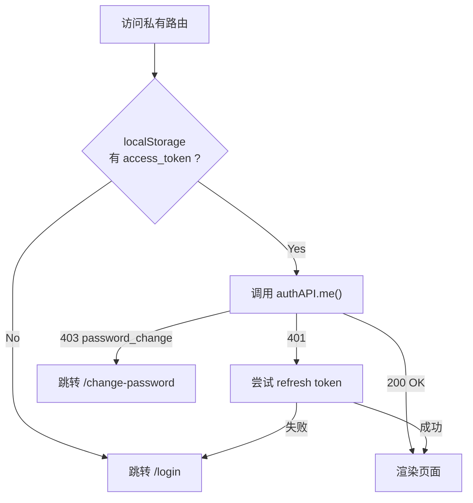
```mermaid
graph TD
    A["访问私有路由"] --> B{"localStorage<br/>有 access_token ?"}
    B -->|No| C["跳转 /login"]
    B -->|Yes| D["调用 authAPI.me()"]
    D -->|200 OK| E["渲染页面"]
    D -->|401| F["尝试 refresh token"]
    F -->|成功| E
    F -->|失败| C
    D -->|403 password_change| G["跳转 /change-password"]
```

### 3.3 状态管理

#### 3.3.1 Zustand Auth Store

全局认证状态，使用 `zustand/persist` 中间件自动持久化到 localStorage：

```typescript
// src/stores/auth.ts
interface AuthState {
  user: User | null;
  accessToken: string | null;
  refreshToken: string | null;
  isAuthenticated: boolean;
  
  setAuth(user: User, accessToken: string, refreshToken: string): void;
  logout(): void;
}
```

**持久化策略**：
- 存储位置：`localStorage`
- 存储键：`access_token`, `refresh_token`
- 页面刷新后自动恢复状态

#### 3.3.2 TanStack Query 服务端数据

所有服务端数据通过 TanStack Query 管理，统一缓存失效与重新获取：

| Query Key | 数据源 | 刷新策略 |
|-----------|--------|---------|
| `['queueStats']` | `queueAPI.getStats()` | 自动 5s 轮询 |
| `['syncStatus']` | `systemAPI.syncStatus()` | 自动 60s 轮询 |
| `['strategies']` | `strategiesAPI.list()` | 手动失效（mutation 后） |
| `['backtest', jobId]` | `backtestAPI.getResult(jobId)` | 按需查询 |
| `['analytics']` | `analyticsAPI.dashboard()` | 手动刷新 |

**QueryClient 全局配置**：
- `refetchOnWindowFocus: false` — 避免切换标签页时频繁请求
- `retry: 1` — 失败最多重试 1 次

#### 3.3.3 组件局部状态

UI 交互状态（表单输入、模态框开关、Tab 切换、侧边栏折叠）由 React `useState` / `useReducer` 管理，不入全局 Store。

### 3.4 API 客户端与拦截器

`src/lib/api.ts` 封装 Axios 实例与全部 API 命名空间：

#### 3.4.1 基础配置

```typescript
const api = axios.create({
  baseURL: import.meta.env.VITE_API_URL || '/api',
  headers: { 'Content-Type': 'application/json' }
});
```

#### 3.4.2 请求拦截器

自动在每个请求的 Header 中注入 `Authorization: Bearer <access_token>`。

#### 3.4.3 响应拦截器

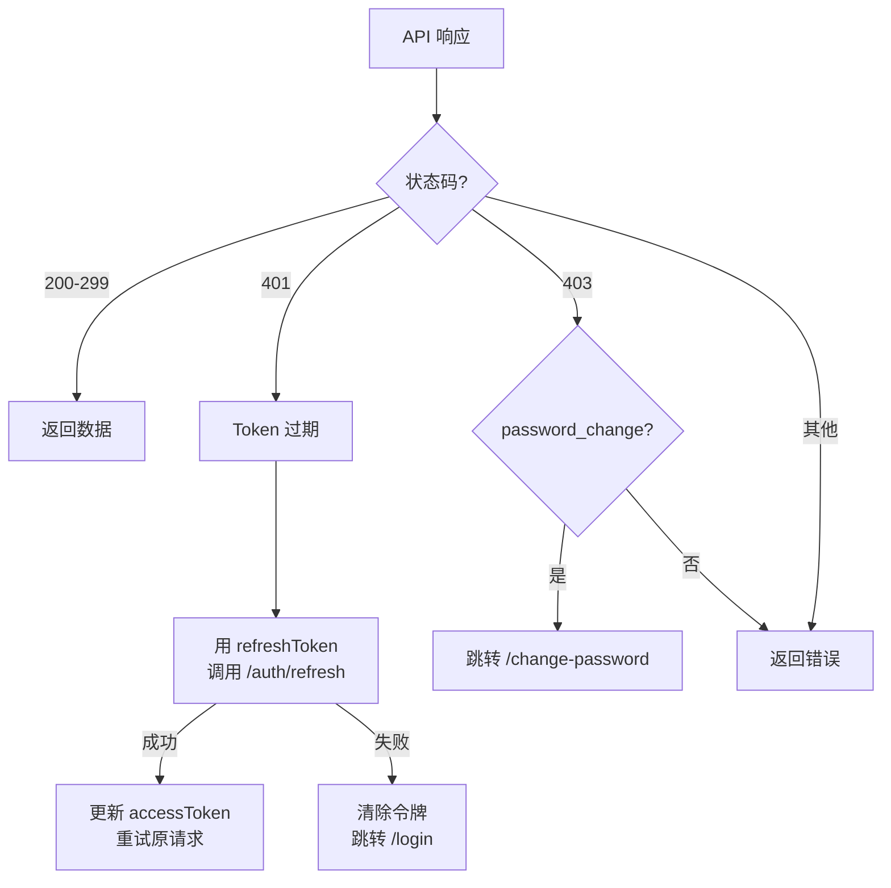
```mermaid
graph TD
    A["API 响应"] --> B{"状态码?"}
    B -->|200-299| C["返回数据"]
    B -->|401| D["Token 过期"]
    D --> E["用 refreshToken<br/>调用 /auth/refresh"]
    E -->|成功| F["更新 accessToken<br/>重试原请求"]
    E -->|失败| G["清除令牌<br/>跳转 /login"]
    B -->|403| H{"password_change?"}
    H -->|是| I["跳转 /change-password"]
    H -->|否| J["返回错误"]
    B -->|其他| J
```

#### 3.4.4 API 命名空间

```typescript
// 按领域组织
authAPI        → POST /auth/login, /register, /refresh, /change-password; GET /auth/me
strategiesAPI  → GET/POST/PUT/DELETE /strategies/*; GET /strategies/builtin
backtestAPI    → POST /backtest, /backtest/batch; GET /backtest/{id}, /backtest/history
queueAPI       → GET /queue/stats, /queue/jobs/*; POST /queue/jobs/cancel; DELETE
marketDataAPI  → GET /data/symbols, /data/history, /data/indicators, /data/overview
analyticsAPI   → GET /analytics/dashboard, /analytics/risk-metrics  ⚠️ 后端未实现
portfolioAPI   → GET /portfolio/positions; POST /portfolio/close     ⚠️ 后端未实现
systemAPI      → GET /system/sync-status
```

> **⚠️ 前后端路径差异**：
> - 前端 `strategiesAPI.listBuiltin()` 调用 `/strategies/builtin`，后端实际路由为 `/strategies/builtin/list`
> - 前端 `backtestAPI.getHistory()` 调用 `/backtest/history`，后端实际路由为 `/backtest/history/list`
> - 前端 `marketDataAPI.history()` 使用 query 参数，后端使用路径参数 `/data/history/{vt_symbol}`
> - `analyticsAPI` 和 `portfolioAPI` 后端路由模块尚未实现

### 3.5 组件层次

```
App (BrowserRouter + QueryClientProvider)
│
├── 公开页面
│   ├── Login                    # 登录表单
│   ├── Register                 # 注册表单
│   └── ChangePassword           # 强制改密
│
└── PrivateRoute → Layout
    │
    ├── Layout                   # 顶层布局
    │   ├── Sidebar              # 侧边导航 (Logo + Menu + Logout)
    │   └── <Outlet />           # 子路由渲染区
    │
    ├── Dashboard                # 仪表盘
    │   ├── StatCards            # 统计卡片 (任务/策略/队列)
    │   └── QueueStatus          # 队列实时状态
    │
    ├── Strategies               # 策略管理
    │   ├── StrategyList         # 策略表格
    │   ├── StrategyForm         # 创建/编辑 (Monaco Editor)
    │   ├── StrategyViewModal    # 详情弹窗
    │   ├── StrategyOptimization # 参数优化面板
    │   └── BuiltinStrategiesModal # 内置策略库
    │
    ├── Backtest                 # 回测
    │   ├── BacktestForm         # 单次回测表单
    │   ├── BulkBacktestForm     # 批量回测表单
    │   ├── BacktestJobList      # 任务列表
    │   ├── BacktestResults      # 结果详情
    │   ├── BulkBacktestSummary  # 批量汇总
    │   └── EquityCurveChart     # 权益曲线图 (Recharts)
    │
    ├── MarketData               # 行情数据
    │   ├── SymbolSearch         # 标的搜索 (防抖 250ms)
    │   ├── MarketOverview       # 指数概览
    │   ├── MarketDataView       # 历史数据表格+图
    │   └── TechnicalIndicators  # 技术指标
    │
    ├── PaperTrading             # 模拟交易 (独立模块)
    │   ├── DeployForm           # 策略部署到模拟 (strategy_id 预填)
    │   ├── PaperOrderForm       # 手动模拟订单提交
    │   ├── DeploymentsTab       # 部署列表 (running/stopped)
    │   ├── OrdersTab            # 模拟订单列表
    │   ├── PositionsTab         # 聚合模拟持仓
    │   └── PerformanceTab       # 模拟绩效指标
    │
    ├── Trading                  # 实盘交易 (Live-Only)
    │   ├── GatewaySelector      # 网关下拉选择
    │   ├── LiveOrderForm        # 实盘订单表单
    │   └── OrdersTable          # 实盘订单列表
    │
    ├── Positions                # 持仓管理 (从 Portfolio 拆分)
    │   ├── GatewaySelector      # 网关选择器
    │   ├── AccountSummary       # 账户资金概览
    │   └── PositionsTable       # 实时持仓表格
    │
    ├── Analytics                # 分析面板
    │   ├── AnalyticsDashboard   # 绩效概览
    │   ├── PerformanceComparison# 策略对比
    │   ├── RiskMetrics          # 风险指标
    │   └── EquityCurveChart     # 复用权益曲线
    │
    └── Portfolio                # 组合管理
        ├── PortfolioManagement  # 持仓管理
        ├── TradingChart         # 交易图表
        └── RiskMetrics          # 复用风险指标
```

**组件统计**：10 个页面 + 35+ 可复用组件

### 3.6 数据流模式

以**策略创建**为例，展示完整的前端数据流：

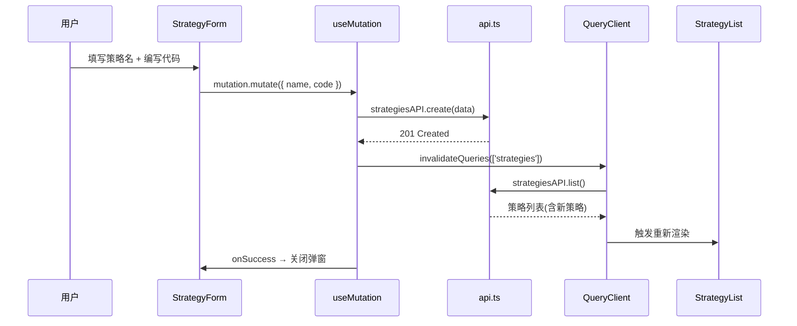
```mermaid
sequenceDiagram
    participant U as 用户
    participant SF as StrategyForm
    participant M as useMutation
    participant API as api.ts
    participant QC as QueryClient
    participant SL as StrategyList
    
    U->>SF: 填写策略名 + 编写代码
    SF->>M: mutation.mutate({ name, code })
    M->>API: strategiesAPI.create(data)
    API-->>M: 201 Created
    M->>QC: invalidateQueries(['strategies'])
    QC->>API: strategiesAPI.list()
    API-->>QC: 策略列表(含新策略)
    QC->>SL: 触发重新渲染
    M->>SF: onSuccess → 关闭弹窗
```

**关键数据流模式**：
1. **乐观更新** — 表单提交后立即关闭弹窗，后台异步完成写入
2. **缓存失效** — Mutation 成功后 `invalidateQueries` 触发列表刷新
3. **轮询更新** — Dashboard 队列状态 5s 轮询，数据同步状态 60s 轮询
4. **条件获取** — 回测结果仅在 `status === 'completed'` 时获取完整数据

---

## 4. 数据库架构

### 4.1 分库策略

系统采用 **5 个逻辑数据库**，物理部署在同一 MySQL 8.0 实例中：

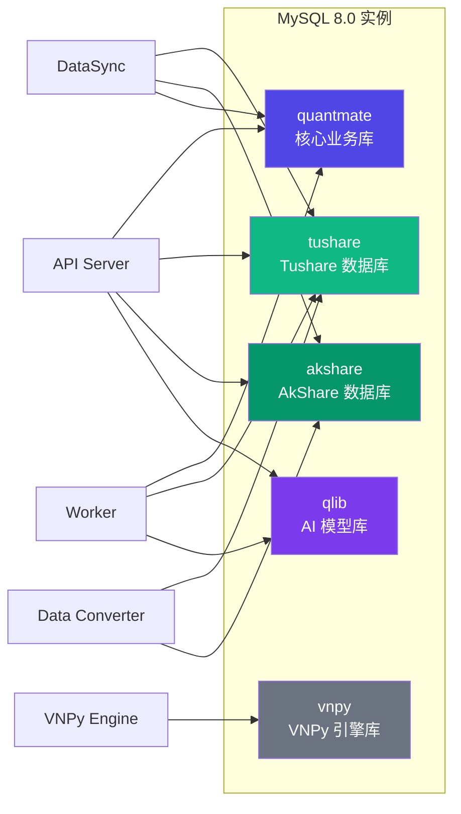
```mermaid
graph LR
    subgraph "MySQL 8.0 实例"
        QM["quantmate<br/>核心业务库"]
        TS["tushare<br/>Tushare 数据库"]
        AK["akshare<br/>AkShare 数据库"]
        VP["vnpy<br/>VNPy 引擎库"]
        QL["qlib<br/>AI 模型库"]
    end
    
    API["API Server"] --> QM
    API --> TS
    API --> AK
    API --> QL
    Worker["Worker"] --> QM
    Worker --> TS
    Worker --> QL
    DS["DataSync"] --> TS
    DS --> AK
    DS --> QM
    VNPy["VNPy Engine"] --> VP
    Converter["Data Converter"] --> TS
    Converter --> AK
    
    style QM fill:#4f46e5,color:#fff
    style TS fill:#10b981,color:#fff
    style AK fill:#059669,color:#fff
    style VP fill:#6b7280,color:#fff
    style QL fill:#7c3aed,color:#fff
```

**分库依据**：

| 数据库 | 用途 | 数据特征 | 活跃表 | 待建表 |
|--------|------|---------|--------|--------|
| `quantmate` | 核心业务 | 高频读写，事务性 | 10 | 31 |
| `tushare` | Tushare 行情 | 大量写入(同步)，高频读取(查询) | 4 | 14 |
| `akshare` | AkShare 辅助 | 低频写入，中频读取 | 2 | 5 |
| `vnpy` | VNPy 引擎 | VNPy 框架内部格式 | 0 | 2 |
| `qlib` | AI 模型 | 因子/训练/预测数据，中频写入 | 6 | 0 |

**分库优势**：
1. **隔离性** — 市场数据同步不影响业务库性能
2. **独立备份** — 行情数据可独立恢复
3. **扩展灵活** — 后续可将行情库迁移到独立实例
4. **权限隔离** — 不同服务可授予不同库的权限

### 4.2 ER 关系图

#### 核心业务库 (quantmate)

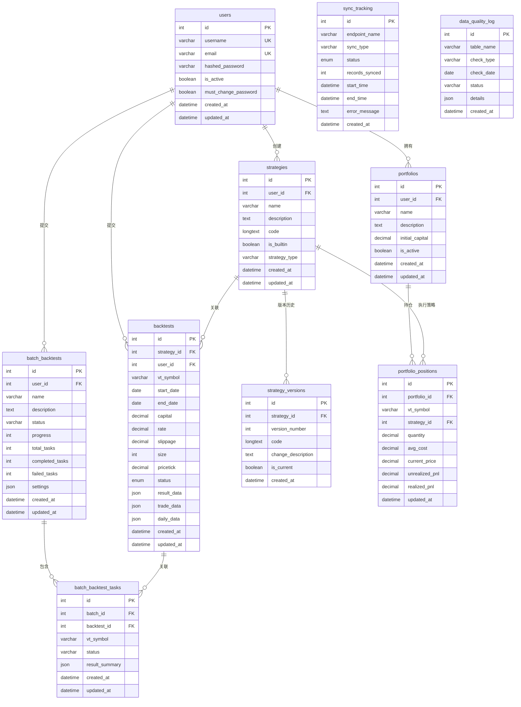
```mermaid
erDiagram
    users ||--o{ strategies : "创建"
    users ||--o{ backtests : "提交"
    users ||--o{ batch_backtests : "提交"
    users ||--o{ portfolios : "拥有"
    strategies ||--o{ strategy_versions : "版本历史"
    strategies ||--o{ backtests : "关联"
    batch_backtests ||--o{ batch_backtest_tasks : "包含"
    backtests ||--o{ batch_backtest_tasks : "关联"
    portfolios ||--o{ portfolio_positions : "持仓"
    strategies ||--o{ portfolio_positions : "执行策略"

    users {
        int id PK
        varchar username UK
        varchar email UK
        varchar hashed_password
        boolean is_active
        boolean must_change_password
        datetime created_at
        datetime updated_at
    }

    strategies {
        int id PK
        int user_id FK
        varchar name
        text description
        longtext code
        boolean is_builtin
        varchar strategy_type
        datetime created_at
        datetime updated_at
    }

    strategy_versions {
        int id PK
        int strategy_id FK
        int version_number
        longtext code
        text change_description
        boolean is_current
        datetime created_at
    }

    backtests {
        int id PK
        int strategy_id FK
        int user_id FK
        varchar vt_symbol
        date start_date
        date end_date
        decimal capital
        decimal rate
        decimal slippage
        int size
        decimal pricetick
        enum status
        json result_data
        json trade_data
        json daily_data
        datetime created_at
        datetime updated_at
    }

    batch_backtests {
        int id PK
        int user_id FK
        varchar name
        text description
        varchar status
        int progress
        int total_tasks
        int completed_tasks
        int failed_tasks
        json settings
        datetime created_at
        datetime updated_at
    }

    batch_backtest_tasks {
        int id PK
        int batch_id FK
        int backtest_id FK
        varchar vt_symbol
        varchar status
        json result_summary
        datetime created_at
        datetime updated_at
    }

    portfolios {
        int id PK
        int user_id FK
        varchar name
        text description
        decimal initial_capital
        boolean is_active
        datetime created_at
        datetime updated_at
    }

    portfolio_positions {
        int id PK
        int portfolio_id FK
        varchar vt_symbol
        int strategy_id FK
        decimal quantity
        decimal avg_cost
        decimal current_price
        decimal unrealized_pnl
        decimal realized_pnl
        datetime updated_at
    }

    sync_tracking {
        int id PK
        varchar endpoint_name
        varchar sync_type
        enum status
        int records_synced
        datetime start_time
        datetime end_time
        text error_message
        datetime created_at
    }

    data_quality_log {
        int id PK
        varchar table_name
        varchar check_type
        date check_date
        varchar status
        json details
        datetime created_at
    }
```

#### 市场数据库 (tushare)

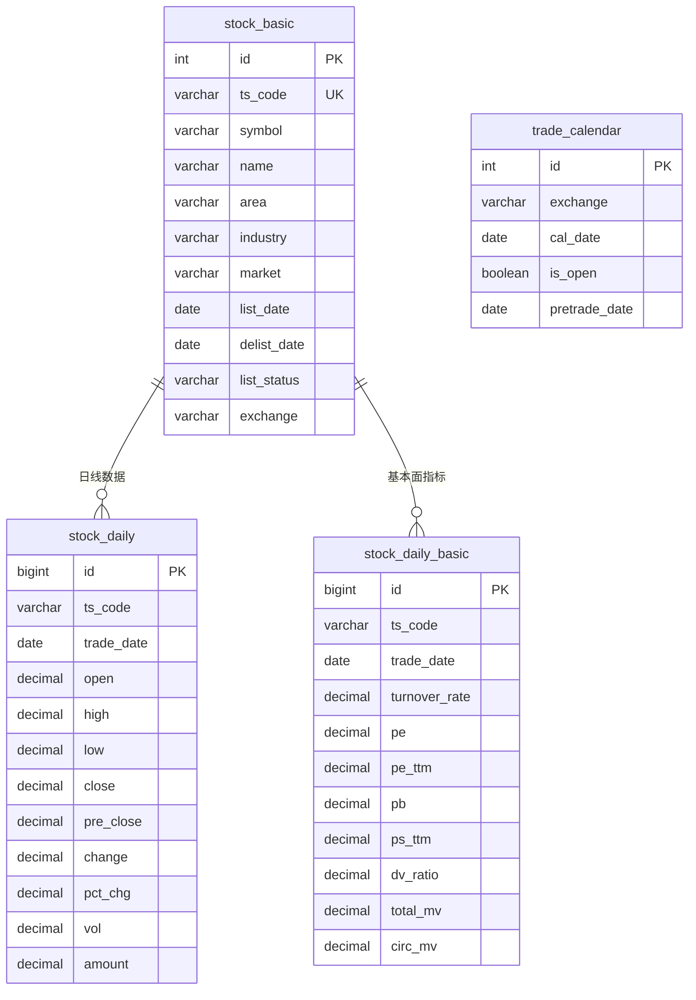
```mermaid
erDiagram
    stock_basic ||--o{ stock_daily : "日线数据"
    stock_basic ||--o{ stock_daily_basic : "基本面指标"

    stock_basic {
        int id PK
        varchar ts_code UK
        varchar symbol
        varchar name
        varchar area
        varchar industry
        varchar market
        date list_date
        date delist_date
        varchar list_status
        varchar exchange
    }

    stock_daily {
        bigint id PK
        varchar ts_code
        date trade_date
        decimal open
        decimal high
        decimal low
        decimal close
        decimal pre_close
        decimal change
        decimal pct_chg
        decimal vol
        decimal amount
    }

    stock_daily_basic {
        bigint id PK
        varchar ts_code
        date trade_date
        decimal turnover_rate
        decimal pe
        decimal pe_ttm
        decimal pb
        decimal ps_ttm
        decimal dv_ratio
        decimal total_mv
        decimal circ_mv
    }

    trade_calendar {
        int id PK
        varchar exchange
        date cal_date
        boolean is_open
        date pretrade_date
    }
```

### 4.3 核心业务库 quantmate

#### 4.3.1 users — 用户表

| 字段 | 类型 | 约束 | 说明 |
|------|------|------|------|
| `id` | INT | PK, AUTO_INCREMENT | 用户 ID |
| `username` | VARCHAR(50) | UNIQUE, NOT NULL | 用户名（不区分大小写） |
| `email` | VARCHAR(100) | UNIQUE, NOT NULL | 邮箱 |
| `hashed_password` | VARCHAR(255) | NOT NULL | bcrypt 哈希密码 |
| `is_active` | BOOLEAN | DEFAULT TRUE | 是否激活 |
| `must_change_password` | BOOLEAN | DEFAULT FALSE | 首次登录强制改密 |
| `created_at` | DATETIME | | 创建时间 |
| `updated_at` | DATETIME | | 更新时间 |

#### 4.3.2 strategies — 策略表

| 字段 | 类型 | 约束 | 说明 |
|------|------|------|------|
| `id` | INT | PK, AUTO_INCREMENT | 策略 ID |
| `user_id` | INT | FK → users.id | 所属用户 |
| `name` | VARCHAR(100) | NOT NULL | 策略名称（同用户下唯一） |
| `description` | TEXT | | 策略描述 |
| `code` | LONGTEXT | | Python 策略代码 |
| `is_builtin` | BOOLEAN | | 是否内置策略 |
| `strategy_type` | VARCHAR(50) | | 策略类型（CTA/Custom） |
| `created_at` | DATETIME | | 创建时间 |
| `updated_at` | DATETIME | | 更新时间 |

**索引**：`INDEX(user_id)`

#### 4.3.3 strategy_versions — 策略版本历史

| 字段 | 类型 | 约束 | 说明 |
|------|------|------|------|
| `id` | INT | PK | 版本 ID |
| `strategy_id` | INT | FK → strategies.id, CASCADE | 策略 ID |
| `version_number` | INT | | 版本号 |
| `code` | LONGTEXT | | 该版本代码快照 |
| `change_description` | TEXT | | 变更说明 |
| `is_current` | BOOLEAN | | 是否当前版本 |
| `created_at` | DATETIME | | 创建时间 |

**约束**：`UNIQUE(strategy_id, version_number)`

#### 4.3.4 backtests — 回测记录

| 字段 | 类型 | 约束 | 说明 |
|------|------|------|------|
| `id` | INT | PK | 回测 ID |
| `strategy_id` | INT | FK → strategies.id | 策略 ID |
| `user_id` | INT | FK → users.id | 用户 ID |
| `vt_symbol` | VARCHAR(20) | | 标的代码（VNPy 格式） |
| `start_date` | DATE | | 回测开始日期 |
| `end_date` | DATE | | 回测结束日期 |
| `capital` | DECIMAL(15,2) | | 初始资金 |
| `rate` | DECIMAL(10,6) | | 手续费率 |
| `slippage` | DECIMAL(10,4) | | 滑点 |
| `size` | INT | | 合约乘数 |
| `pricetick` | DECIMAL(10,4) | | 最小价格变动 |
| `status` | ENUM | pending/running/completed/failed/cancelled | 状态 |
| `result_data` | JSON | | 绩效指标 |
| `trade_data` | JSON | | 交易记录 |
| `daily_data` | JSON | | 每日权益 |
| `created_at` | DATETIME | | 创建时间 |
| `updated_at` | DATETIME | | 更新时间 |

#### 4.3.5 batch_backtests — 批量回测任务

| 字段 | 类型 | 约束 | 说明 |
|------|------|------|------|
| `id` | INT | PK | 批量任务 ID |
| `user_id` | INT | FK → users.id | 用户 ID |
| `name` | VARCHAR(100) | | 任务名称 |
| `description` | TEXT | | 描述 |
| `status` | VARCHAR(20) | | 任务状态 |
| `progress` | INT | | 进度百分比 |
| `total_tasks` | INT | | 子任务总数 |
| `completed_tasks` | INT | | 已完成数 |
| `failed_tasks` | INT | | 失败数 |
| `settings` | JSON | | 共享回测参数 |
| `created_at` | DATETIME | | 创建时间 |
| `updated_at` | DATETIME | | 更新时间 |

#### 4.3.6 batch_backtest_tasks — 批量子任务

| 字段 | 类型 | 约束 | 说明 |
|------|------|------|------|
| `id` | INT | PK | 子任务 ID |
| `batch_id` | INT | FK → batch_backtests.id, CASCADE | 父任务 ID |
| `backtest_id` | INT | FK → backtests.id | 关联单次回测 |
| `vt_symbol` | VARCHAR(20) | | 标的代码 |
| `status` | VARCHAR(20) | | 状态 |
| `result_summary` | JSON | | 结果摘要 |
| `created_at` | DATETIME | | 创建时间 |
| `updated_at` | DATETIME | | 更新时间 |

#### 4.3.7 portfolios — 投资组合

| 字段 | 类型 | 约束 | 说明 |
|------|------|------|------|
| `id` | INT | PK | 组合 ID |
| `user_id` | INT | FK → users.id | 用户 ID |
| `name` | VARCHAR(100) | | 组合名称 |
| `description` | TEXT | | 描述 |
| `initial_capital` | DECIMAL(15,2) | | 初始资金 |
| `is_active` | BOOLEAN | | 是否激活 |
| `created_at` / `updated_at` | DATETIME | | 时间戳 |

#### 4.3.8 portfolio_positions — 组合持仓

| 字段 | 类型 | 约束 | 说明 |
|------|------|------|------|
| `id` | INT | PK | 持仓 ID |
| `portfolio_id` | INT | FK → portfolios.id, CASCADE | 组合 ID |
| `vt_symbol` | VARCHAR(20) | | 标的代码 |
| `strategy_id` | INT | FK → strategies.id, NULL | 关联策略 |
| `quantity` | DECIMAL(15,4) | | 持仓数量 |
| `avg_cost` | DECIMAL(15,4) | | 平均成本 |
| `current_price` | DECIMAL(15,4) | | 当前价格 |
| `unrealized_pnl` | DECIMAL(15,2) | | 浮动盈亏 |
| `realized_pnl` | DECIMAL(15,2) | | 已实现盈亏 |
| `updated_at` | DATETIME | | 更新时间 |

#### 4.3.9 sync_tracking — 数据同步追踪

| 字段 | 类型 | 约束 | 说明 |
|------|------|------|------|
| `id` | INT | PK | 记录 ID |
| `endpoint_name` | VARCHAR(100) | | 端点名称 |
| `sync_type` | VARCHAR(50) | | 同步类型 |
| `status` | ENUM | pending/running/completed/failed | 状态 |
| `records_synced` | INT | | 同步记录数 |
| `start_time` / `end_time` | DATETIME | | 同步耗时 |
| `error_message` | TEXT | | 错误信息 |
| `created_at` | DATETIME | | 创建时间 |

#### 4.3.10 data_quality_log — 数据质量日志

| 字段 | 类型 | 约束 | 说明 |
|------|------|------|------|
| `id` | INT | PK | 记录 ID |
| `table_name` | VARCHAR(100) | | 目标表名 |
| `check_type` | VARCHAR(50) | | 检查类型 |
| `check_date` | DATE | | 检查日期 |
| `status` | VARCHAR(20) | | 检查结果 |
| `details` | JSON | | 详细信息 |
| `created_at` | DATETIME | | 创建时间 |

### 4.4 市场数据库 tushare

#### 4.4.1 stock_basic — A 股基本信息

| 字段 | 类型 | 约束 | 说明 |
|------|------|------|------|
| `id` | INT | PK | ID |
| `ts_code` | VARCHAR(20) | UNIQUE | 标的代码 (000001.SZ) |
| `symbol` | VARCHAR(10) | | 股票代码 |
| `name` | VARCHAR(50) | | 股票名称 |
| `area` | VARCHAR(20) | | 地区 |
| `industry` | VARCHAR(50) | | 行业 |
| `market` | VARCHAR(20) | | 市场（主板/创业板/科创板） |
| `list_date` | DATE | | 上市日期 |
| `delist_date` | DATE | NULL | 退市日期 |
| `list_status` | VARCHAR(1) | | L=上市 D=退市 P=暂停 |
| `exchange` | VARCHAR(10) | | 交易所（SSE/SZSE/BSE） |

#### 4.4.2 stock_daily — A 股日线数据

| 字段 | 类型 | 约束 | 说明 |
|------|------|------|------|
| `id` | BIGINT | PK, AUTO_INCREMENT | ID |
| `ts_code` | VARCHAR(20) | | 标的代码 |
| `trade_date` | DATE | | 交易日 |
| `open` | DECIMAL | | 开盘价 |
| `high` | DECIMAL | | 最高价 |
| `low` | DECIMAL | | 最低价 |
| `close` | DECIMAL | | 收盘价 |
| `pre_close` | DECIMAL | | 昨收价 |
| `change` | DECIMAL | | 涨跌额 |
| `pct_chg` | DECIMAL | | 涨跌幅(%) |
| `vol` | DECIMAL | | 成交量（手） |
| `amount` | DECIMAL | | 成交额（千元） |

**约束**：`UNIQUE(ts_code, trade_date)`  
**索引**：`INDEX(trade_date)`, `INDEX(ts_code)`

#### 4.4.3 stock_daily_basic — 每日基本面指标

| 字段 | 类型 | 说明 |
|------|------|------|
| `ts_code` / `trade_date` | VARCHAR / DATE | 联合唯一 |
| `turnover_rate` / `turnover_rate_f` | DECIMAL | 换手率 / 自由流通换手率 |
| `volume_ratio` | DECIMAL | 量比 |
| `pe` / `pe_ttm` | DECIMAL | 市盈率 / 滚动市盈率 |
| `pb` | DECIMAL | 市净率 |
| `ps` / `ps_ttm` | DECIMAL | 市销率 |
| `dv_ratio` / `dv_ttm` | DECIMAL | 股息率 |
| `total_share` / `float_share` / `free_share` | DECIMAL | 总股本/流通股/自由流通股 |
| `total_mv` / `circ_mv` | DECIMAL | 总市值/流通市值 |

**约束**：`UNIQUE(ts_code, trade_date)`

#### 4.4.4 trade_calendar — 交易日历

| 字段 | 类型 | 约束 | 说明 |
|------|------|------|------|
| `id` | INT | PK | ID |
| `exchange` | VARCHAR(10) | | 交易所 |
| `cal_date` | DATE | | 日期 |
| `is_open` | BOOLEAN | | 是否交易日 |
| `pretrade_date` | DATE | | 上一交易日 |

**约束**：`UNIQUE(exchange, cal_date)`

### 4.5 辅助数据库 akshare

#### 4.5.1 stock_zh_index_daily — A 股指数日线

| 字段 | 类型 | 约束 | 说明 |
|------|------|------|------|
| `date` | DATE | | 交易日 |
| `code` | VARCHAR(20) | | 指数代码 |
| `open` / `high` / `low` / `close` | DECIMAL | | OHLC |
| `volume` | DECIMAL | | 成交量 |

**约束**：`UNIQUE(code, date)`

#### 4.5.2 tool_trade_date_hist — 交易日历（AkShare 来源）

| 字段 | 类型 | 约束 | 说明 |
|------|------|------|------|
| `trade_date` | DATE | PRIMARY KEY | 交易日 |

### 4.6 交易引擎库 vnpy

VNPy 引擎库用于存储实盘交易相关的 K 线和 Tick 数据，供 VNPy MainEngine 和 CTA 策略引擎直接使用。此数据库与 tushare/akshare 完全隔离。

当前无活跃表，待建：

| 表名 | 用途 | 优先级 |
|------|------|--------|
| `dbbardata` | VNPy 标准 K 线存储 | P2 |
| `dbtickdata` | VNPy Tick 数据存储 | P3 |

### 4.7 AI 模型库 qlib

Qlib 数据库存储因子研究、模型训练和预测结果。数据源来自 tushare/akshare（非 vnpy），经 `data_converter.py` 转换后写入 Qlib 二进制格式供模型训练使用，训练结果和预测分数存入本库。

#### 4.7.1 因子存储

| 表名 | 用途 | 活跃行估算 | 说明 |
|------|------|-----------|------|
| `alpha_factor_values` | 计算后的因子值 | 百万级 | 每 instrument×日期×因子集×因子名 一行 |
| `alpha_factor_sets` | 因子集定义 | 预置 2 行 | Alpha158(158 因子), Alpha360(360 因子) |

**alpha_factor_values 结构**：

```sql
instrument   VARCHAR(20)   -- e.g. SH600000 (Qlib 格式)
trade_date   DATE
factor_set   VARCHAR(30)   -- Alpha158, Alpha360, custom
factor_name  VARCHAR(100)
factor_value DOUBLE
UNIQUE KEY (instrument, trade_date, factor_set, factor_name)
```

#### 4.7.2 模型训练与预测

| 表名 | 用途 | 说明 |
|------|------|------|
| `model_training_runs` | 训练任务记录 | 支持 8 种模型：LightGBM, Linear, LSTM, GRU, Transformer, ALSTM, TabNet, HIST |
| `model_predictions` | 预测信号分数 | 每训练运行×instrument×日期，包含 score 和 rank_pct |

**model_training_runs 关键字段**：

| 字段 | 类型 | 说明 |
|------|------|------|
| `model_type` | VARCHAR(50) | LightGBM / LSTM / Transformer / HIST 等 |
| `factor_set` | VARCHAR(30) | Alpha158 / Alpha360 |
| `universe` | VARCHAR(50) | csi300 / csi500 / all_a |
| `train_start/end` | DATE | 训练区间 |
| `valid_start/end` | DATE | 验证区间 |
| `test_start/end` | DATE | 测试区间 |
| `hyperparams` | JSON | 模型超参数 |
| `metrics` | JSON | 训练结果指标（IC, ICIR, Rank IC 等） |
| `status` | ENUM | queued → running → completed / failed |
| `model_path` | VARCHAR(500) | 模型文件保存路径 |

#### 4.7.3 Qlib 回测结果

| 表名 | 用途 | 说明 |
|------|------|------|
| `qlib_backtest_results` | 基于信号的组合回测 | 支持 TopkDropout / WeightedAvg 策略 |

**qlib_backtest_results 关键字段**：

| 字段 | 类型 | 说明 |
|------|------|------|
| `training_run_id` | INT | 关联的模型训练运行 |
| `strategy_type` | VARCHAR(50) | TopkDropout / WeightedAvg |
| `topk` | INT | 持仓股票数（默认 50） |
| `n_drop` | INT | 每期调仓数（默认 5） |
| `statistics` | JSON | 年化收益、最大回撤、夏普比等 |
| `portfolio_analysis` | JSON | 多空分析、换手率、IC 分析 |

#### 4.7.4 数据转换日志

| 表名 | 用途 | 说明 |
|------|------|------|
| `data_conversion_log` | 数据转换追踪 | 记录 tushare/akshare → Qlib 二进制格式的转换状态 |

#### 4.7.5 数据流关系

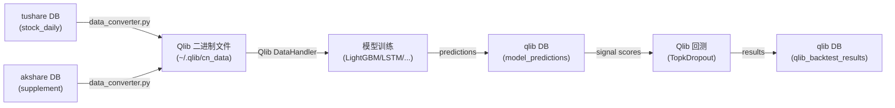
```mermaid
graph LR
    TS["tushare DB<br/>(stock_daily)"] -->|data_converter.py| QB["Qlib 二进制文件<br/>(~/.qlib/cn_data)"]
    AK["akshare DB<br/>(supplement)"] -->|data_converter.py| QB
    QB -->|Qlib DataHandler| Model["模型训练<br/>(LightGBM/LSTM/...)"]
    Model -->|predictions| QDB["qlib DB<br/>(model_predictions)"]
    QDB -->|signal scores| BT["Qlib 回测<br/>(TopkDropout)"]
    BT -->|results| QDB2["qlib DB<br/>(qlib_backtest_results)"]
```

### 4.8 待建设表清单

#### quantmate 库（31 表）

| 表名 | 用途 | 关联模块 | 优先级 |
|------|------|----------|--------|
| `user_profiles` | 用户详细资料（KYC 信息） | 账户 | P1 |
| `roles` / `user_roles` / `permissions` | RBAC 权限模型 | 账户 | P1 |
| `api_keys` | API 密钥管理 | 账户 | P2 |
| `user_sessions` | 会话管理 | 账户 | P2 |
| `mfa_settings` | MFA 配置 | 账户 | P2 |
| `watchlists` / `watchlist_items` | 自选股列表 | 数据 | P1 |
| `indicator_configs` | 自定义指标参数 | 数据 | P2 |
| `data_source_items` | 数据项开关配置 | 数据 | P1 |
| `strategy_tags` | 策略标签 | 策略 | P2 |
| `strategy_shares` | 策略分享记录 | 协作 | P3 |
| `optimization_tasks` / `optimization_results` | 参数优化 | 回测 | P2 |
| `portfolio_transactions` | 组合交易流水 | 组合 | P1 |
| `portfolio_snapshots` | 组合净值快照 | 组合 | P1 |
| `risk_rules` | 风控规则配置 | 风险 | P2 |
| `orders` | 订单表（mode 字段区分实盘/模拟） | 交易 | P2 |
| `trades` | 成交记录 | 交易 | P2 |
| `paper_deployments` | 模拟交易策略部署记录 | 模拟交易 | P2 |
| `broker_configs` | 券商配置 | 交易 | P2 |
| `alert_rules` | 告警规则 | 监控 | P2 |
| `alert_history` | 告警历史 | 监控 | P2 |
| `notification_channels` | 通知通道配置 | 监控 | P2 |
| `reports` | 报告存档 | 报告 | P2 |
| `trade_logs` | 交易日志（审计） | 报告 | P1 |
| `system_configs` | 系统配置 | 设置 | P2 |
| `audit_logs` | 审计日志 | 设置 | P1 |
| `data_source_configs` | 数据源配置 | 设置 | P2 |
| `team_workspaces` / `workspace_members` | 团队工作空间 | 协作 | P3 |
| `strategy_comments` / `strategy_ratings` | 社区评论评分 | 协作 | P3 |
| `marketplace_listings` | 模板市场 | 协作 | P4 |
| `ai_conversations` | AI 对话历史 | AI | P3 |
| `ai_model_configs` | AI 模型配置 | AI | P3 |

#### tushare 库（14 表）

| 表名 | 用途 | 优先级 |
|------|------|--------|
| `stock_weekly` / `stock_monthly` | 周线/月线数据 | P1 |
| `index_daily` | 指数日线 | P1 |
| `adj_factor` | 复权因子 | P1 |
| `money_flow` | 资金流向 | P2 |
| `stk_limit` | 涨跌停 | P2 |
| `margin_detail` | 融资融券 | P2 |
| `block_trade` | 大宗交易 | P2 |
| `stock_company` | 公司基本面 | P2 |
| `fina_indicator` | 财务指标 | P2 |
| `hk_daily` / `hk_basic` | 港股日线/基本信息 | P2 |
| `us_daily` / `us_basic` | 美股日线/基本信息 | P3 |
| `fx_daily` | 汇率日线 | P3 |

#### akshare 库（5 表）

| 表名 | 用途 | 优先级 |
|------|------|--------|
| `stock_zh_index_spot` | 指数实时行情 | P2 |
| `macro_china` | 宏观经济数据 | P3 |
| `fund_etf_daily` | ETF 日线 | P2 |
| `bond_zh_daily` | 债券日线 | P3 |
| `news_sentiment` | 新闻情绪 | P3 |

### 4.9 索引与优化策略

#### 已实施索引

| 表 | 索引 | 类型 | 用途 |
|----|------|------|------|
| `stock_daily` | `(ts_code, trade_date)` | UNIQUE | 防重复 + 精确查询 |
| `stock_daily` | `(trade_date)` | INDEX | 按日期范围查询 |
| `stock_daily` | `(ts_code)` | INDEX | 按标的查询 |
| `stock_basic` | `(ts_code)` | UNIQUE | 标的唯一标识 |
| `trade_calendar` | `(exchange, cal_date)` | UNIQUE | 交易日历查询 |
| `strategies` | `(user_id)` | INDEX | 按用户查询策略 |
| `strategy_versions` | `(strategy_id, version_number)` | UNIQUE | 版本唯一性 |

#### 优化策略

| 策略 | 说明 | 适用场景 |
|------|------|---------|
| **联合索引** | 高频查询模式（ts_code + trade_date） | K 线数据查询 |
| **分区表** | 按年份分区（stock_daily 数据量大） | 历史数据归档 |
| **覆盖索引** | 索引包含查询所需全部字段 | 列表查询优化 |
| **查询缓存** | Redis 缓存热点数据（交易日历等） | 高频读取 |
| **EXPLAIN 分析** | 复杂查询使用 EXPLAIN 验证执行计划 | 慢查询优化 |
| **只读从库** | 行情查询走读副本（扩展期） | 读写分离 |

---

## 5. 数据同步架构

### 5.1 DataSync Daemon 总体设计

DataSync 是一个**独立容器服务**，负责从外部数据源（Tushare、AkShare）拉取市场数据并写入本地 MySQL。

#### 5.1.1 运行模式

| 模式 | 启动方式 | 行为 |
|------|---------|------|
| **Daemon** | `--daemon`（默认） | 启动时执行全量同步 → 进入调度循环（每日 02:00 同步 + 每 6h 补数据） |
| **Daily** | `--daily` | 执行一次当日同步后退出 |
| **Backfill** | `--backfill` | 执行一次缺失数据回填后退出 |
| **Init** | `--init` | 初始化 sync_tracking 表（回溯 15 年），不同步数据 |
| **Refresh Calendar** | `--refresh-calendar` | 刷新交易日历缓存 |
| **Dry Run** | 环境变量 `DRY_RUN=1` | 全部写入操作跳过，仅日志输出 |

#### 5.1.2 配置项

| 配置项 | 环境变量 | 默认值 | 说明 |
|--------|---------|--------|------|
| 同步时间 | `SYNC_HOUR` / `SYNC_MINUTE` | 2 / 0 | 每日自动同步时间（上海时区） |
| 回填间隔 | `BACKFILL_INTERVAL_HOURS` | 6 | 自动回填频率（小时） |
| 回填天数 | `BACKFILL_DAYS` | 30 | 回填回溯天数 |
| 批量大小 | `BATCH_SIZE` | 100 | 每批同步的股票数 |
| 最大重试 | `MAX_RETRIES` | 3 | 单步最大重试次数 |
| 回溯天数 | `LOOKBACK_DAYS` | 60 | 日常增量回溯天数 |
| 时区 | — | `Asia/Shanghai` | 硬编码 |

#### 5.1.3 Daemon 生命周期

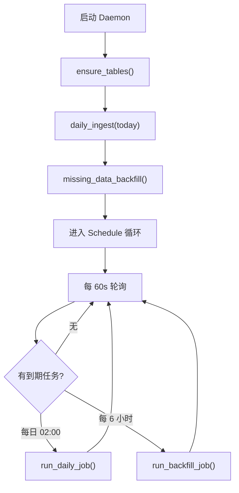
```mermaid
graph TD
    Start["启动 Daemon"] --> Init["ensure_tables()"]
    Init --> Daily["daily_ingest(today)"]
    Daily --> Backfill["missing_data_backfill()"]
    Backfill --> Loop["进入 Schedule 循环"]
    
    Loop --> Poll["每 60s 轮询"]
    Poll --> Check{"有到期任务?"}
    Check -->|"每日 02:00"| RunDaily["run_daily_job()"]
    Check -->|"每 6 小时"| RunBackfill["run_backfill_job()"]
    Check -->|"无"| Poll
    RunDaily --> Poll
    RunBackfill --> Poll
```

### 5.2 数据源适配层

#### 5.2.1 Tushare 适配器 — `tushare_ingest.py`

**核心函数** `call_pro(api_name, **kwargs)`：

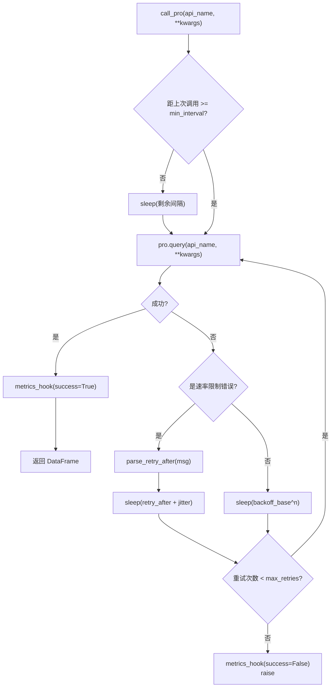
```mermaid
graph TD
    Call["call_pro(api_name, **kwargs)"] --> Interval{"距上次调用 >= min_interval?"}
    Interval -->|"否"| Sleep["sleep(剩余间隔)"]
    Sleep --> Invoke
    Interval -->|"是"| Invoke["pro.query(api_name, **kwargs)"]
    Invoke --> Result{"成功?"}
    Result -->|"是"| Hook["metrics_hook(success=True)"]
    Hook --> Return["返回 DataFrame"]
    Result -->|"否"| Error{"是速率限制错误?"}
    Error -->|"是"| Parse["parse_retry_after(msg)"]
    Parse --> Wait["sleep(retry_after + jitter)"]
    Wait --> Retry{"重试次数 < max_retries?"}
    Error -->|"否"| Backoff["sleep(backoff_base^n)"]
    Backoff --> Retry
    Retry -->|"是"| Invoke
    Retry -->|"否"| Fail["metrics_hook(success=False)<br/>raise"]
```

**已接入端点**：

| Tushare 端点 | 函数 | 目标表 | 速率限制（次/分） |
|-------------|------|--------|-----------------|
| `daily` | `ingest_daily()` | `stock_daily` | 60 |
| `stock_basic` | `ingest_stock_basic()` | `stock_basic` | 5 |
| `adj_factor` | `ingest_adj_factor()` | `adj_factor`（待建） | 10 |
| `daily_basic` | `ingest_daily_basic()` | `stock_daily_basic` | 60 |
| `dividend` | `ingest_dividend()` | `dividend`（待建） | 10 |
| `top10_holders` | `ingest_top10_holders()` | `top10_holders`（待建） | 10 |
| `index_daily` | `ingest_index_daily()` | `index_daily`（待建） | 30 |
| `income` | `ingest_income()` | `income`（待建） | — |
| `moneyflow` | `ingest_moneyflow()` | `moneyflow`（待建） | — |
| `margin_detail` | `ingest_margin()` | `margin_detail`（待建） | — |
| `block_trade` | `ingest_block_trade()` | `block_trade`（待建） | — |

**速率限制配置**：

每个端点的速率限制可通过环境变量覆盖：`TUSHARE_RATE_<ENDPOINT>=<calls_per_min>`。默认 `DEFAULT_CALLS_PER_MIN=50`。

#### 5.2.2 AkShare 适配器 — `akshare_ingest.py`

**核心函数** `call_ak(api_name, fn, **kwargs)` 与 `call_pro` 模式一致。

**已接入指数**：

| 指数代码 | 名称 | AkShare API |
|---------|------|------------|
| `sh000300` | 沪深300 | `stock_zh_index_daily` |
| `sh000001` | 上证综指 | `stock_zh_index_daily` |
| `sz399001` | 深证成指 | `stock_zh_index_daily` |
| `sh000016` | 上证50 | `stock_zh_index_daily` |
| `sh000905` | 中证500 | `stock_zh_index_daily` |
| `sh000852` | 中证1000 | `stock_zh_index_daily` |

默认限速：`AKSHARE_CALLS_PER_MIN=30`，`stock_zh_index_daily=60`。

#### 5.2.3 VNPy 适配器 — `vnpy_ingest.py`

将 Tushare 库中的日线数据转换为 VNPy 标准 `dbbardata` 格式：

| Tushare 字段 | VNPy 字段 | 转换规则 |
|-------------|----------|---------|
| `ts_code` 前缀 | `symbol` | `000001.SZ` → `000001` |
| `ts_code` 后缀 | `exchange` | `SZ`→`SZSE`, `SH`→`SSE`, `BJ`→`BSE` |
| `trade_date` | `datetime` | `date` → `datetime(Y,M,D)` |
| `open` | `open_price` | 直接映射 |
| `vol` | `volume` | 直接映射 |
| `amount` | `turnover` | 直接映射 |

### 5.3 同步生命周期

#### 5.3.1 每日同步 7 步骤流程

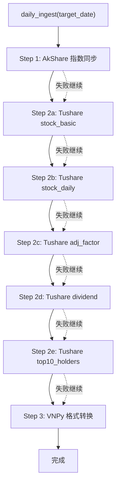
```mermaid
graph TD
    Start["daily_ingest(target_date)"] --> S1["Step 1: AkShare 指数同步"]
    S1 --> S2a["Step 2a: Tushare stock_basic"]
    S2a --> S2b["Step 2b: Tushare stock_daily"]
    S2b --> S2c["Step 2c: Tushare adj_factor"]
    S2c --> S2d["Step 2d: Tushare dividend"]
    S2d --> S2e["Step 2e: Tushare top10_holders"]
    S2e --> S3["Step 3: VNPy 格式转换"]
    S3 --> Done["完成"]
    
    S1 -.->|"失败继续"| S2a
    S2a -.->|"失败继续"| S2b
    S2b -.->|"失败继续"| S2c
    S2c -.->|"失败继续"| S2d
    S2d -.->|"失败继续"| S2e
    S2e -.->|"失败继续"| S3
```

每一步返回 `(status, rows_synced, error_message)` 三元组。状态枚举：

```
PENDING → RUNNING → SUCCESS | PARTIAL | ERROR
```

#### 5.3.2 步骤状态枚举

| SyncStep | 数据源 | 说明 |
|----------|--------|------|
| `AKSHARE_INDEX` | AkShare | 6 支指数日线 |
| `TUSHARE_STOCK_BASIC` | Tushare | A 股基础信息 |
| `TUSHARE_STOCK_DAILY` | Tushare | 全市场日线 |
| `TUSHARE_ADJ_FACTOR` | Tushare | 复权因子 |
| `TUSHARE_DIVIDEND` | Tushare | 分红数据 |
| `TUSHARE_TOP10_HOLDERS` | Tushare | 十大股东 |
| `VNPY_SYNC` | 本地转换 | Tushare → VNPy 格式 |

### 5.4 速率限制机制

系统采用**双层速率限制**：

#### 第一层：最小调用间隔

每个 API 端点维护 `_last_call` 时间戳，确保调用间隔 ≥ `60s / calls_per_min`：

```python
# 示例：daily 端点限 60 次/分
min_interval = 60.0 / 60 = 1.0s  # 每次调用间隔 ≥ 1s
```

#### 第二层：服务端限速响应

当收到速率限制错误时：
1. **解析等待时间** — 从错误消息中提取 `retry_after`（支持中英文、秒/分钟/毫秒单位）
2. **添加随机抖动** — `wait_time + random(0, jitter)` 避免雷群效应
3. **指数退避** — 非速率限制错误使用 `backoff_base^retry_count` 退避

### 5.5 断点续传

#### 5.5.1 步骤级断点

`daily_ingest()` 执行每步前检查 `get_step_status(sync_date, step)`：
- 若状态为 `SUCCESS` → **跳过该步骤**
- 否则 → 设为 `RUNNING` → 执行 → 更新最终状态

服务重启后重新执行同一日同步时，已成功的步骤不会重复执行。

#### 5.5.2 批量级断点

批量日期范围函数（如 `ingest_dividend_by_date_range()`）支持 `start_after_ts_code` 参数：
- 记录上次处理到的最后一个 `ts_code`
- 重启后从该点之后继续，避免全部重做

#### 5.5.3 增量同步

`ingest_all_daily()` 默认为增量模式：
- 查询每个标的已有数据的 `max(trade_date)`
- 仅拉取该日期之后的新数据
- `force_full=True` 可切换为全量模式

### 5.6 数据项开关管理

> 对应 PRD §3.2.12「数据源 / 数据项开关管理」

#### 5.6.1 设计目标

不同 Tushare 权限等级的用户可使用的数据项不同。通过**数据项开关**，管理员可按数据源和数据项粒度控制同步范围，避免因权限不足导致同步失败。

#### 5.6.2 当前实现状态

目前数据源和端点列表为**硬编码**：

```python
# data_sync_daemon.py
REQUIRED_ENDPOINTS = [
    'stock_basic', 'stock_daily', 'adj_factor',
    'daily_basic', 'dividend', 'top10_holders'
]

# akshare_ingest.py
INDEX_MAPPING = {
    'sh000300': '沪深300', 'sh000001': '上证综指',
    'sz399001': '深证成指', 'sh000016': '上证50',
    'sh000905': '中证500', 'sh000852': '中证1000'
}
```

#### 5.6.3 目标架构

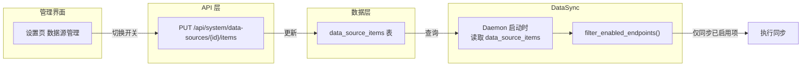
```mermaid
graph LR
    subgraph "管理界面"
        UI["设置页 数据源管理"]
    end
    
    subgraph "API 层"
        API["PUT /api/system/data-sources/{id}/items"]
    end
    
    subgraph "数据层"
        Table["data_source_items 表"]
    end
    
    subgraph "DataSync"
        Daemon["Daemon 启动时<br/>读取 data_source_items"]
        Filter["filter_enabled_endpoints()"]
    end
    
    UI -->|"切换开关"| API
    API -->|"更新"| Table
    Table -->|"查询"| Daemon
    Daemon --> Filter
    Filter -->|"仅同步已启用项"| Sync["执行同步"]
```

**数据模型**（`data_source_items` 表，待建 P1）：

| 字段 | 类型 | 说明 |
|------|------|------|
| `id` | INT PK | 主键 |
| `source_name` | VARCHAR(50) | 数据源名 (tushare/akshare) |
| `item_key` | VARCHAR(100) | 数据项标识 (stock_daily/adj_factor/...) |
| `display_name` | VARCHAR(100) | 显示名称 |
| `is_enabled` | BOOLEAN | 是否启用 |
| `required_permission` | VARCHAR(50) | 所需最低权限 |
| `description` | TEXT | 描述 |
| `updated_at` | DATETIME | 最后修改时间 |

**Tushare 数据项（8 项）**：

| 数据项 | API 端点 | 默认状态 | 所需权限 |
|--------|---------|---------|---------|
| 股票基础信息 | `stock_basic` | ✅ 开启 | 基础版 |
| 日线行情 | `stock_daily` | ✅ 开启 | 基础版 |
| 复权因子 | `adj_factor` | ✅ 开启 | 基础版 |
| 每日基本面 | `daily_basic` | ✅ 开启 | 高级版 |
| 分红数据 | `dividend` | ⬜ 关闭 | 高级版 |
| 十大股东 | `top10_holders` | ⬜ 关闭 | 高级版 |
| 财务指标 | `fina_indicator` | ⬜ 关闭 | 企业版 |
| 资金流向 | `moneyflow` | ⬜ 关闭 | 企业版 |

**AkShare 数据项（2 项）**：

| 数据项 | API 端点 | 默认状态 | 所需权限 |
|--------|---------|---------|---------|
| 指数日线 | `stock_zh_index_daily` | ✅ 开启 | 免费 |
| 交易日历 | `tool_trade_date_hist_sina` | ✅ 开启 | 免费 |

### 5.7 数据质量保障

#### 5.7.1 质量检查项

| 检查项 | 方式 | 说明 |
|--------|------|------|
| **去重** | `UNIQUE(ts_code, trade_date)` 约束 | 数据库层面防止重复 |
| **完整性** | `sync_tracking` 状态跟踪 | 每步/每交易日记录状态 |
| **回填** | 自动回填机制 | 每 6 小时扫描失败记录并重试 |
| **审计** | `data_quality_log` 表 | 记录每次同步的行数/状态/异常 |
| **空值处理** | `NaT → None` 转换 | Pandas NaT 在入库前转为 SQL NULL |
| **日期校验** | 交易日历过滤 | 仅在交易日同步数据 |

#### 5.7.2 Prometheus 监控指标

| 指标 | 类型 | 说明 |
|------|------|------|
| `datasync_api_calls_total` | Counter | 按 API 端点统计调用次数 |
| `datasync_api_errors_total` | Counter | 按 API 端点统计错误次数 |
| `datasync_rate_limit_hits_total` | Counter | 按 API 端点统计限速次数 |
| `datasync_rows_ingested_total` | Counter | 按目标表统计入库行数 |
| `datasync_failed_steps_total` | Counter | 按步骤统计失败次数 |
| `datasync_backfill_lock_status` | Gauge | 回填锁状态（1=健康, 0=异常） |

---

## 6. API 接口设计

### 6.1 设计原则

| 原则 | 说明 |
|------|------|
| **RESTful** | 资源导向 URL，标准 HTTP 方法 |
| **JWT 保护** | 除登录/注册/数据查询外，所有端点需认证 |
| **统一前缀** | 所有端点使用 `/api` 前缀 |
| **Pydantic 校验** | 请求/响应使用 Pydantic V2 模型严格校验 |
| **领域异常映射** | 领域层 ValueError/KeyError/PermissionError → HTTP 400/404/401 |
| **分页支持** | 列表接口支持 `limit` + `offset` 参数 |

### 6.2 已实现接口

#### 6.2.1 认证模块 `/api/auth`

| 端点 | 方法 | 认证 | 请求体 | 响应 | 说明 |
|------|------|------|--------|------|------|
| `/auth/register` | POST | 否 | `UserCreate` | `User` (201) | 用户注册 |
| `/auth/login` | POST | 否 | `UserLogin` | `Token` (200) | 登录并获取 JWT |
| `/auth/refresh` | POST | 否 | `{refresh_token}` | `Token` (200) | 刷新 access_token |
| `/auth/me` | GET | 是 | — | `User` (200) | 获取当前用户信息 |
| `/auth/change-password` | POST | 是 | `PasswordChangeRequest` | `{detail}` (200) | 修改密码 |

#### 6.2.2 策略模块 `/api/strategies`

| 端点 | 方法 | 认证 | 请求体 | 响应 | 说明 |
|------|------|------|--------|------|------|
| `/strategies` | GET | 是 | — | `List[StrategyListItem]` | 列出用户策略 |
| `/strategies` | POST | 是 | `StrategyCreate` | `Strategy` (201) | 创建策略 |
| `/strategies/{id}` | GET | 是 | — | `Strategy` | 获取策略详情 |
| `/strategies/{id}` | PUT | 是 | `StrategyUpdate` | `Strategy` | 更新策略 |
| `/strategies/{id}` | DELETE | 是 | — | 204 | 删除策略 |
| `/strategies/{id}/validate` | POST | 是 | — | `StrategyValidation` | 校验策略代码 |
| `/strategies/{id}/code-history` | GET | 是 | — | `List[VersionEntry]` | 版本历史列表 |
| `/strategies/{id}/code-history/{hid}` | GET | 是 | — | `VersionEntry` | 单个版本详情 |
| `/strategies/{id}/code-history/{hid}/restore` | POST | 是 | — | `{message}` | 恢复指定版本 |
| `/strategies/builtin/list` | GET | 否 | — | `List[StrategyListItem]` | 内置策略列表 |

#### 6.2.3 回测模块 `/api/backtest`

| 端点 | 方法 | 认证 | 请求体 | 响应 | 说明 |
|------|------|------|--------|------|------|
| `/backtest` | POST | 是 | `BacktestRequest` | `BacktestSubmitResponse` | 提交单次回测 |
| `/backtest/batch` | POST | 是 | `BatchBacktestRequest` | `BacktestSubmitResponse` | 提交批量回测 |
| `/backtest/{job_id}` | GET | 是 | — | `BacktestJob` | 查询任务状态 |
| `/backtest/batch/{job_id}` | GET | 是 | — | `BatchBacktestJob` | 查询批量任务状态 |
| `/backtest/history/list` | GET | 是 | — | `List[BacktestHistory]` | 历史记录列表 |
| `/backtest/history/{job_id}` | GET | 是 | — | `BacktestHistory` | 历史结果详情 |
| `/backtest/{job_id}` | DELETE | 是 | — | 200 | 取消/删除任务 |

> **注意**：`/backtest` 系列使用 FastAPI `BackgroundTasks` 进程内执行，适合轻量快速回测。

#### 6.2.4 数据模块 `/api/data`

| 端点 | 方法 | 认证 | 参数 | 响应 | 说明 |
|------|------|------|------|------|------|
| `/data/symbols` | GET | 可选 | `exchange`, `keyword`, `limit`, `offset` | `List[SymbolInfo]` | 搜索标的 |
| `/data/history/{vt_symbol}` | GET | 可选 | `start_date`, `end_date`, `interval` | `List[OHLCBar]` | K 线数据 |
| `/data/indicators/{vt_symbol}` | GET | 可选 | `start_date`, `end_date` | `IndicatorData` | 技术指标（MA/MACD/KDJ/RSI/BOLL） |

> **⚠️ 前后端不一致**：后端使用路径参数 `/data/history/{vt_symbol}`，但前端 `api.ts` 使用 query 参数 `/data/history?symbol=xxx`。需要统一（建议后端保持路径参数，前端修正调用方式）。
| `/data/overview` | GET | 可选 | — | `MarketOverview` | 市场概览 |
| `/data/sectors` | GET | 可选 | — | `List[Sector]` | 板块信息 |
| `/data/exchanges` | GET | 可选 | — | `List[Exchange]` | 交易所信息 |
| `/data/indexes` | GET | 可选 | — | `List[IndexInfo]` | 可用指数列表 |
| `/data/symbols-by-filter` | GET | 可选 | `industry`, `exchange` | `List[SymbolInfo]` | 筛选标的 |

#### 6.2.5 队列模块 `/api/queue`

| 端点 | 方法 | 认证 | 说明 |
|------|------|------|------|
| `/queue/stats` | GET | 是 | 队列统计（pending/running/completed/failed） |
| `/queue/jobs` | GET | 是 | 用户任务列表 |
| `/queue/jobs/{job_id}` | GET | 是 | 任务详情 |
| `/queue/jobs/{job_id}/cancel` | POST | 是 | 取消任务 |
| `/queue/jobs/{job_id}` | DELETE | 是 | 删除任务及结果 |
| `/queue/backtest` | POST | 是 | 提交回测到 RQ 队列（异步 Worker） |
| `/queue/bulk-backtest` | POST | 是 | 提交批量回测到 RQ 队列 |
| `/queue/bulk-jobs/{job_id}/results` | GET | 是 | 批量任务子结果（分页） |
| `/queue/bulk-jobs/{job_id}/summary` | GET | 是 | 批量任务汇总统计 |

> **注意**：`/queue/backtest` 和 `/queue/bulk-backtest` 使用 RQ Worker 异步执行，适合大型回测任务。

#### 6.2.6 系统模块 `/api/system`

| 端点 | 方法 | 认证 | 说明 |
|------|------|------|------|
| `/system/sync-status` | GET | 是 | 数据同步状态 |

#### 6.2.7 实盘交易模块 `/api/v1/trade`（Live-Only）

> **注**：Paper trading 已拆分至独立模块 `/api/v1/paper-trade`（见 §6.2.9）。
> `/trade/orders POST` 提交 `mode: "paper"` 会返回 400 错误并提示使用 paper-trade 端点。

**手动交易**：

| 端点 | 方法 | 认证 | 说明 |
|------|------|------|------|
| `/trade/orders` | POST | 是 | 提交实盘订单（必须指定 `gateway_name`） |
| `/trade/orders` | GET | 是 | 查询实盘订单列表 |
| `/trade/orders/{order_id}` | GET | 是 | 订单详情 |
| `/trade/orders/{order_id}/cancel` | POST | 是 | 撤单 |

**算法交易**：

| 端点 | 方法 | 认证 | 说明 |
|------|------|------|------|
| `/trade/algo/twap` | POST | 是 | TWAP 分时委托 |
| `/trade/algo/vwap` | POST | 是 | VWAP 量价加权委托 |
| `/trade/algo/iceberg` | POST | 是 | 冰山委托 |

**网关管理**：

| 端点 | 方法 | 认证 | 说明 |
|------|------|------|------|
| `/trade/gateway/connect` | POST | 是 | 连接 CTP/XTP/SIM 网关 |
| `/trade/gateway/disconnect` | POST | 是 | 断开网关 |
| `/trade/gateways` | GET | 是 | 已连接网关列表 |
| `/trade/gateway/positions` | GET | 是 | 指定网关持仓查询 |
| `/trade/gateway/account` | GET | 是 | 指定网关账户资金 |

**CTA 自动化策略**：

| 端点 | 方法 | 认证 | 说明 |
|------|------|------|------|
| `/trade/auto-strategy/start` | POST | 是 | 启动 CTA 策略（编译并执行） |
| `/trade/auto-strategy/stop` | POST | 是 | 停止运行中策略 |
| `/trade/auto-strategy/status` | GET | 是 | 运行中策略列表 |

#### 6.2.9 模拟交易模块 `/api/v1/paper-trade`

**策略部署**：

| 端点 | 方法 | 认证 | 说明 |
|------|------|------|------|
| `/paper-trade/deploy` | POST | 是 | 部署策略到模拟交易 |
| `/paper-trade/deployments` | GET | 是 | 部署列表 |
| `/paper-trade/deployments/{id}/stop` | POST | 是 | 停止模拟部署 |

**模拟订单**：

| 端点 | 方法 | 认证 | 说明 |
|------|------|------|------|
| `/paper-trade/orders` | POST | 是 | 提交模拟订单（market 类型自动成交） |
| `/paper-trade/orders` | GET | 是 | 查询模拟订单（自动过滤 mode=paper） |
| `/paper-trade/orders/{id}/cancel` | POST | 是 | 撤销模拟订单 |

**持仓与绩效**：

| 端点 | 方法 | 认证 | 说明 |
|------|------|------|------|
| `/paper-trade/positions` | GET | 是 | 聚合模拟持仓（从已成交订单计算） |
| `/paper-trade/performance` | GET | 是 | 模拟交易绩效（P&L/权益曲线/最大回撤） |

#### 6.2.8 AI 模型模块 `/api/ai/qlib`

| 端点 | 方法 | 认证 | 说明 |
|------|------|------|------|
| `/ai/qlib/status` | GET | 是 | Qlib 可用性检查 |
| `/ai/qlib/supported-models` | GET | 是 | 支持的 8 种模型列表 |
| `/ai/qlib/supported-datasets` | GET | 是 | 支持的因子集（Alpha158/Alpha360） |
| `/ai/qlib/train` | POST | 是 | 提交模型训练任务（异步执行） |
| `/ai/qlib/training-runs` | GET | 是 | 用户训练运行列表（支持分页 + status 过滤） |
| `/ai/qlib/training-runs/{run_id}` | GET | 是 | 训练运行详情 |
| `/ai/qlib/training-runs/{run_id}/predictions` | GET | 是 | 预测信号分数（支持 trade_date + top_n） |
| `/ai/qlib/data/convert` | POST | 是 | tushare/akshare → Qlib 格式转换（异步执行） |

#### 6.2.9 因子研究模块 `/api/factors`

**基础因子 CRUD**（已有）：

| 端点 | 方法 | 认证 | 说明 |
|------|------|------|------|
| `/factors` | GET | 是 | 因子列表 |
| `/factors` | POST | 是 | 创建因子 |
| `/factors/{factor_id}` | GET / PUT / DELETE | 是 | 因子详情/更新/删除 |
| `/factors/{factor_id}/evaluations` | GET / POST / DELETE | 是 | 因子评估 CRUD |

**Qlib 因子计算**：

| 端点 | 方法 | 认证 | 说明 |
|------|------|------|------|
| `/factors/qlib/factor-sets` | GET | 是 | Qlib 因子集列表（从 `alpha_factor_sets` 表） |
| `/factors/qlib/compute` | POST | 是 | 计算指定因子集的因子值 |

### 6.3 Pydantic 请求/响应模型

#### 6.3.1 认证模型

```python
class UserCreate(BaseModel):
    username: str          # 3-50 字符
    email: EmailStr        # 合法邮箱
    password: str          # 8+ 字符

class UserLogin(BaseModel):
    username: str
    password: str

class Token(BaseModel):
    access_token: str
    refresh_token: str
    token_type: str = "bearer"

class TokenData(BaseModel):
    username: Optional[str]
    user_id: Optional[int]

class PasswordChangeRequest(BaseModel):
    current_password: str
    new_password: str
```

#### 6.3.2 策略模型

```python
class StrategyCreate(BaseModel):
    name: str
    description: Optional[str]
    code: str
    strategy_type: Optional[str] = "CTA"

class StrategyUpdate(BaseModel):
    name: Optional[str]
    description: Optional[str]
    code: Optional[str]
    change_description: Optional[str]  # 版本变更说明
```

#### 6.3.3 回测模型

```python
class BacktestRequest(BaseModel):
    strategy_id: int
    symbol: str            # 标的代码
    start_date: str        # "YYYY-MM-DD"
    end_date: str
    initial_capital: float = 1_000_000
    rate: float = 0.0003   # 手续费率
    slippage: float = 0.2
    size: int = 100        # 合约乘数
    pricetick: float = 0.01
    parameters: Optional[Dict] = None
    benchmark: Optional[str] = "399300.SZ"

class BatchBacktestRequest(BaseModel):
    strategy_id: int
    symbols: List[str]     # 多标的列表
    # ... 其余与 BacktestRequest 相同
    engine_type: str = "vnpy"  # "vnpy" 或 "qlib"
    # Qlib 专用（engine_type="qlib" 时）
    model_type: Optional[str]       # LightGBM / LSTM / Transformer 等
    factor_set: Optional[str]       # Alpha158 / Alpha360
    universe: Optional[str]         # csi300 / csi500 / all_a
    strategy_type: Optional[str]    # TopkDropout / WeightedAvg
    topk: Optional[int]             # 持仓数（默认 50）
    n_drop: Optional[int]           # 每期调仓数（默认 5）
    hyperparams: Optional[Dict]     # 模型超参数
```

#### 6.3.4 Qlib 训练模型

```python
class TrainModelRequest(BaseModel):
    model_type: str = "LightGBM"       # 8 种支持模型之一
    factor_set: str = "Alpha158"       # Alpha158 / Alpha360
    universe: str = "csi300"           # csi300 / csi500 / all_a
    train_start: str = "2018-01-01"
    train_end: str = "2022-12-31"
    valid_start: str = "2023-01-01"
    valid_end: str = "2023-06-30"
    test_start: str = "2023-07-01"
    test_end: str = "2024-12-31"
    hyperparams: Optional[Dict] = None

class DataConvertRequest(BaseModel):
    start_date: Optional[str] = None
    end_date: Optional[str] = None
    use_akshare_supplement: bool = False
```

#### 6.3.5 交易模型

```python
class GatewayConnectRequest(BaseModel):
    gateway_name: str              # 网关名称
    gateway_type: str              # "ctp" / "xtp" / "sim"
    settings: Dict[str, Any] = {}  # CTP: userid, password, brokerid, ...

class AutoStrategyStartRequest(BaseModel):
    strategy_class_name: str       # CTA 策略类名
    vt_symbol: str                 # VNPy 格式标的（如 rb2501.SHFE）
    parameters: Dict[str, Any] = {}
    strategy_code: Optional[str]   # 策略源码（编译后加载）
    strategy_id: Optional[int]     # 或从 DB 加载
    gateway_name: Optional[str]    # 指定网关
```

### 6.4 待建设接口

#### 6.4.1 按模块规划

| 模块 | 端点 | 优先级 | 说明 |
|------|------|--------|------|
| **账户** | `GET /api/auth/profile` | P1 | 用户资料 |
| **账户** | `PUT /api/auth/profile` | P1 | 更新资料 |
| **账户** | `POST /api/auth/mfa/setup` | P2 | MFA 配置 |
| **数据** | `GET /api/data/watchlists` | P1 | 自选股列表 |
| **数据** | `POST /api/data/watchlists` | P1 | 创建自选股组 |
| **数据** | `PUT /api/data/watchlists/{id}` | P1 | 更新自选股 |
| **系统** | `GET /api/system/data-sources` | P1 | 数据源列表 |
| **系统** | `PUT /api/system/data-sources/{id}/items` | P1 | 更新数据项开关 |
| **组合** | `GET /api/portfolio/{id}/transactions` | P1 | 交易流水 |
| **组合** | `GET /api/portfolio/{id}/snapshots` | P1 | 净值快照 |
| **风控** | `GET /api/risk/rules` | P2 | 风控规则 |
| **风控** | `POST /api/risk/rules` | P2 | 创建规则 |
| **交易** | ~~`POST /api/trade/orders`~~ | ~~P2~~ | ✅ 已实现（见 §6.2.7） |
| **交易** | ~~`GET /api/trade/orders`~~ | ~~P2~~ | ✅ 已实现（见 §6.2.7） |
| **报告** | `GET /api/reports/generate` | P2 | 生成报表 |
| **AI** | ~~Qlib 模型训练/预测~~ | ~~P1~~ | ✅ 已实现（见 §6.2.8） |
| **AI** | `POST /api/ai/strategy/generate` | P3 | AI 生成策略 |
| **AI** | `POST /api/ai/query` | P3 | 自然语言查询 |
| **告警** | `GET /api/alerts/rules` | P2 | 告警规则列表 |
| **告警** | `POST /api/alerts/rules` | P2 | 创建告警规则 |
| **协作** | `GET /api/marketplace` | P4 | 模板市场 |

### 6.5 错误码体系

#### 6.5.1 HTTP 状态码映射

| HTTP 码 | 触发条件 | 领域异常 |
|---------|---------|---------|
| 200 | 请求成功 | — |
| 201 | 资源创建成功 | — |
| 204 | 删除成功 | — |
| 400 | 参数校验失败 / 业务规则违反 | `ValueError` |
| 401 | 未认证 / Token 过期 | `PermissionError("disabled")` |
| 403 | 权限不足 / 需要改密 | `PermissionError` |
| 404 | 资源不存在 | `KeyError` |
| 422 | Pydantic 校验失败 | FastAPI 自动处理 |
| 500 | 服务器内部错误 | 未捕获异常 |

#### 6.5.2 统一响应格式（目标）

```json
// 成功
{
  "data": { ... },
  "meta": { "page": 1, "total": 100 }
}

// 错误
{
  "error": {
    "code": "STRATEGY_NOT_FOUND",
    "message": "策略不存在",
    "detail": "strategy_id=42"
  }
}
```

### 6.6 版本策略

当前为 **V1 单版本**，所有端点位于 `/api/` 前缀下。

**未来版本迁移方案**：
1. 新增 `/api/v2/` 前缀路由
2. V1 端点保持兼容至少 6 个月
3. 通过 `Deprecation` 响应头通知客户端
4. 版本控制通过 URL 前缀，不使用 Header 协商

---

## 7. 异步任务架构

### 7.1 RQ Worker 设计

QuantMate 采用 **RQ（Redis Queue）** 作为异步任务队列，将耗时的回测和优化任务从 API 进程中解耦。

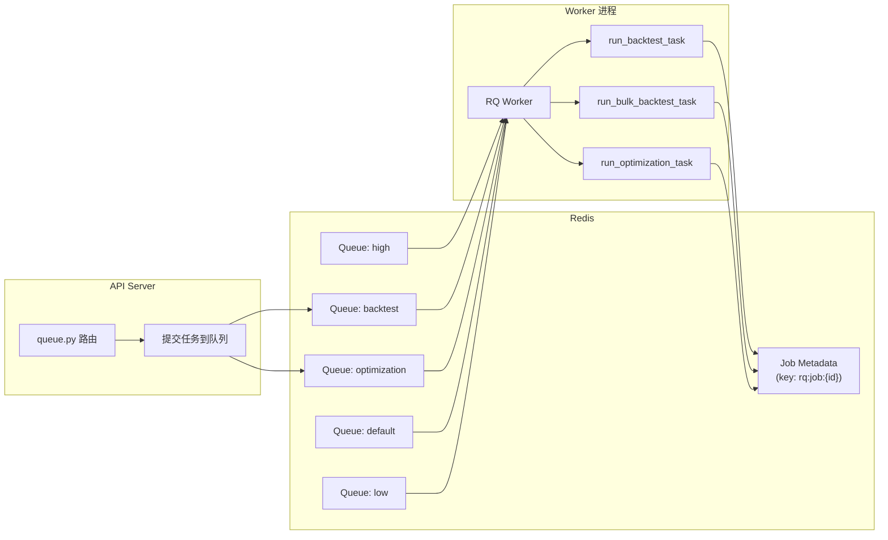
```mermaid
graph LR
    subgraph "API Server"
        Route["queue.py 路由"]
        Submit["提交任务到队列"]
    end
    
    subgraph "Redis"
        Q1["Queue: high"]
        Q2["Queue: backtest"]
        Q3["Queue: optimization"]
        Q4["Queue: default"]
        Q5["Queue: low"]
        Meta["Job Metadata<br/>(key: rq:job:{id})"]
    end
    
    subgraph "Worker 进程"
        W["RQ Worker"]
        T1["run_backtest_task"]
        T2["run_bulk_backtest_task"]
        T3["run_optimization_task"]
    end
    
    Route --> Submit
    Submit --> Q2
    Submit --> Q3
    Q1 --> W
    Q2 --> W
    Q3 --> W
    Q4 --> W
    Q5 --> W
    W --> T1
    W --> T2
    W --> T3
    T1 --> Meta
    T2 --> Meta
    T3 --> Meta
```

### 7.2 队列拓扑

| 队列名 | 超时时间 | 用途 | 优先级 |
|--------|---------|------|--------|
| `high` | 10 min | 保留给高优先级任务 | 1（最高） |
| `backtest` | 1 hour | 单次/批量回测 | 2 |
| `optimization` | 2 hours | 参数优化（遗传算法） | 3 |
| `default` | 30 min | 通用任务 | 4 |
| `low` | 1 hour | 低优先级后台任务 | 5 |

**Worker 默认监听顺序**：`['backtest', 'optimization', 'default']`（可通过命令行参数自定义）

**队列选择逻辑**：
- 单次回测 → `backtest` 队列
- 批量回测 → `backtest` 队列
- 参数优化 → `optimization` 队列

### 7.3 任务生命周期

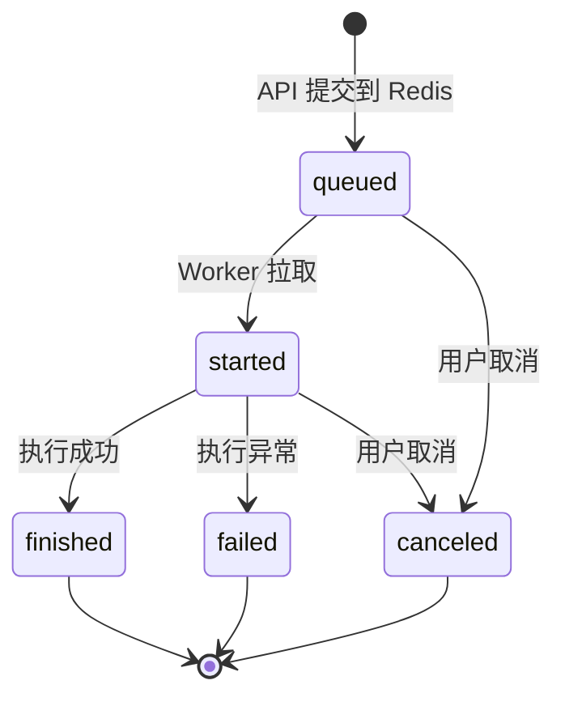
```mermaid
stateDiagram-v2
    [*] --> queued: API 提交到 Redis
    queued --> started: Worker 拉取
    started --> finished: 执行成功
    started --> failed: 执行异常
    queued --> canceled: 用户取消
    started --> canceled: 用户取消
    
    finished --> [*]
    failed --> [*]
    canceled --> [*]
```

| 状态 | 存储位置 | 说明 |
|------|---------|------|
| `queued` | Redis Queue | 等待 Worker 拉取 |
| `started` | Redis Job Meta | Worker 开始执行 |
| `finished` | Redis Meta + MySQL `backtests` | 执行完成，结果持久化 |
| `failed` | Redis Meta + MySQL `backtests` | 执行失败，错误信息记录 |
| `canceled` | Redis Meta | 用户主动取消 |

**双路径提交**：

| 路径 | 端点 | 执行方式 | 适用场景 |
|------|------|---------|---------|
| **In-Process** | `POST /backtest` | FastAPI `BackgroundTasks` | 轻量回测，即时反馈 |
| **RQ Queue** | `POST /queue/backtest` | RQ Worker 异步 | 大型回测，批量任务 |

### 7.4 任务实现

#### 7.4.1 单次回测 — `run_backtest_task()`

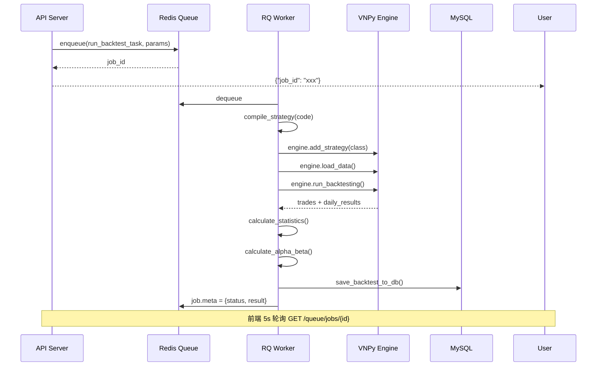
```mermaid
sequenceDiagram
    participant API as API Server
    participant Redis as Redis Queue
    participant Worker as RQ Worker
    participant VNPy as VNPy Engine
    participant DB as MySQL
    
    API->>Redis: enqueue(run_backtest_task, params)
    Redis-->>API: job_id
    API-->>User: {"job_id": "xxx"}
    
    Worker->>Redis: dequeue
    Worker->>Worker: compile_strategy(code)
    Worker->>VNPy: engine.add_strategy(class)
    Worker->>VNPy: engine.load_data()
    Worker->>VNPy: engine.run_backtesting()
    VNPy-->>Worker: trades + daily_results
    Worker->>Worker: calculate_statistics()
    Worker->>Worker: calculate_alpha_beta()
    Worker->>DB: save_backtest_to_db()
    Worker->>Redis: job.meta = {status, result}
    
    Note over API,User: 前端 5s 轮询 GET /queue/jobs/{id}
```

**任务参数**：

| 参数 | 类型 | 说明 |
|------|------|------|
| `strategy_code` | str | Python 策略源代码 |
| `strategy_class_name` | str | 策略类名 |
| `symbol` | str | 标的代码 |
| `start_date` / `end_date` | str | 回测时间范围 |
| `initial_capital` | float | 初始资金 |
| `rate` | float | 手续费率 |
| `slippage` | float | 滑点 |
| `size` | int | 合约乘数 |
| `pricetick` | float | 最小价格变动 |
| `parameters` | Dict | 策略参数覆盖 |
| `benchmark` | str | 基准指数代码 |
| `user_id` | int | 用户 ID |
| `strategy_id` | int | 策略 ID |

**执行流程**：
1. 从 RQ 获取 `job_id`
2. 编译策略代码（`compile_strategy`）或从数据库加载（`StrategySourceDao`）
3. 初始化 VNPy `BacktestingEngine`
4. 加载行情数据 → 运行回测 → 提取交易记录 + 每日数据
5. 计算绩效指标（总收益、夏普、最大回撤等）
6. 计算 Alpha/Beta（与沪深300基准对比）
7. 持久化到 MySQL + Redis

#### 7.4.2 批量回测 — `run_bulk_backtest_task()`

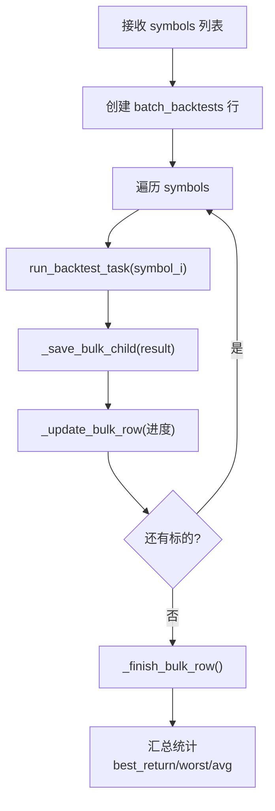
```mermaid
graph TD
    Start["接收 symbols 列表"] --> Init["创建 batch_backtests 行"]
    Init --> Loop["遍历 symbols"]
    Loop --> Run["run_backtest_task(symbol_i)"]
    Run --> Save["_save_bulk_child(result)"]
    Save --> Progress["_update_bulk_row(进度)"]
    Progress --> Next{"还有标的?"}
    Next -->|"是"| Loop
    Next -->|"否"| Finish["_finish_bulk_row()"]
    Finish --> Summary["汇总统计<br/>best_return/worst/avg"]
```

**特点**：
- 循环调用 `run_backtest_task`（非并行，避免 VNPy 资源冲突）
- 每个子任务结果实时更新进度
- 跟踪最佳/最差/平均收益
- 失败不中断，`continue_on_error=True`

#### 7.4.3 参数优化 — `run_optimization_task()`

使用 VNPy 内置的遗传算法优化器：

| 参数 | 说明 |
|------|------|
| `optimization_settings.population_size` | 种群大小 |
| `optimization_settings.ngen_size` | 进化代数 |
| `optimization_settings.parameters` | 参数搜索空间 `{name: [min, max, step]}` |
| `optimization_settings.target` | 优化目标（默认 `total_return`） |

### 7.5 Redis 数据结构

| Key 模式 | 类型 | TTL | 内容 |
|---------|------|-----|------|
| `rq:job:{job_id}` | Hash | Worker 默认 | RQ 标准任务元数据 |
| `job_storage:{job_id}` | Hash | 7 天 | 自定义任务结果（status/result/error） |
| `rq:queue:{name}` | List | — | 队列中等待的任务 ID |
| `rq:workers` | Set | — | 活跃 Worker 注册表 |

**JobStorageService** 提供对 `job_storage:*` 键的封装：

```python
class JobStorageService:
    def store_meta(job_id, data: dict)      # SET + TTL 7天
    def get_meta(job_id) -> Optional[dict]  # GET + JSON 反序列化
    def delete_meta(job_id)                 # DEL
```

### 7.6 Worker 扩展策略

| 扩展方式 | 说明 | 实现状态 |
|---------|------|---------|
| **垂直扩展** | 单 Worker 增加 CPU/内存 | ✅ 可用 |
| **水平扩展** | 多 Worker 容器共享 Redis 队列 | ✅ 可用（`docker-compose scale worker=N`） |
| **队列隔离** | 不同 Worker 监听不同队列 | ✅ 可用（命令行参数） |
| **资源限制** | Worker 容器 `mem_limit: 1g` | ✅ 已配置 |
| **定时清理** | 过期任务自动清理 | ⬜ 待实现 |
| **死信队列** | 多次失败任务转入死信队列 | ⬜ 待实现 |

---

## 8. 安全架构

### 8.1 认证流程

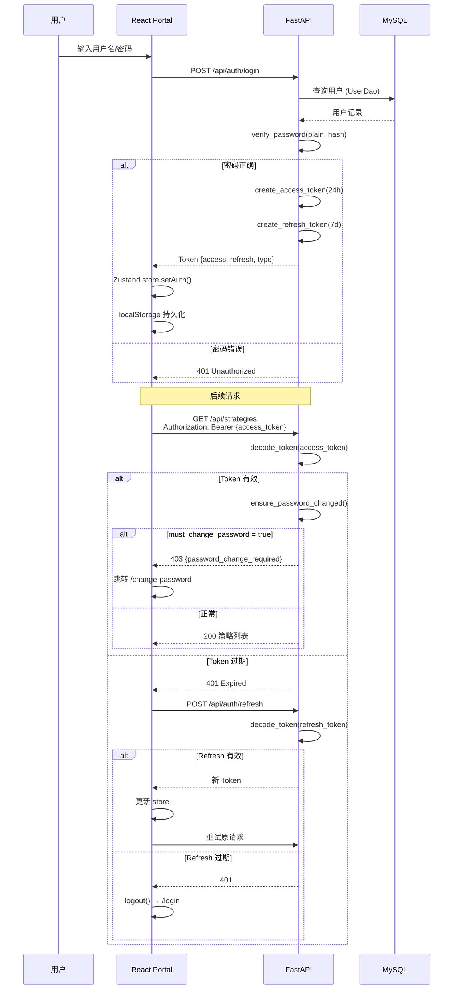
```mermaid
sequenceDiagram
    participant U as 用户
    participant FE as React Portal
    participant API as FastAPI
    participant DB as MySQL
    
    U->>FE: 输入用户名/密码
    FE->>API: POST /api/auth/login
    API->>DB: 查询用户 (UserDao)
    DB-->>API: 用户记录
    API->>API: verify_password(plain, hash)
    
    alt 密码正确
        API->>API: create_access_token(24h)
        API->>API: create_refresh_token(7d)
        API-->>FE: Token {access, refresh, type}
        FE->>FE: Zustand store.setAuth()
        FE->>FE: localStorage 持久化
    else 密码错误
        API-->>FE: 401 Unauthorized
    end
    
    Note over FE,API: 后续请求
    FE->>API: GET /api/strategies<br/>Authorization: Bearer {access_token}
    API->>API: decode_token(access_token)
    
    alt Token 有效
        API->>API: ensure_password_changed()
        alt must_change_password = true
            API-->>FE: 403 {password_change_required}
            FE->>FE: 跳转 /change-password
        else 正常
            API-->>FE: 200 策略列表
        end
    else Token 过期
        API-->>FE: 401 Expired
        FE->>API: POST /api/auth/refresh
        API->>API: decode_token(refresh_token)
        alt Refresh 有效
            API-->>FE: 新 Token
            FE->>FE: 更新 store
            FE->>API: 重试原请求
        else Refresh 过期
            API-->>FE: 401
            FE->>FE: logout() → /login
        end
    end
```

### 8.2 JWT 双令牌机制

| 令牌类型 | 有效期 | 载荷 | 用途 |
|---------|--------|------|------|
| **Access Token** | 24h（staging 30min） | `user_id`, `username`, `type=access`, `must_change_password`, `exp` | API 请求认证 |
| **Refresh Token** | 7 天 | `user_id`, `username`, `type=refresh`, `must_change_password`, `exp` | 刷新 Access Token |

**签名配置**：

| 参数 | 生产 | 说明 |
|------|------|------|
| 算法 | HS256 | HMAC-SHA256 对称签名 |
| 密钥 | `SECRET_KEY`（环境变量） | 必须设置，无默认值 |
| 库 | PyJWT | 标准 JWT 操作 |

**Token 解码安全**：
- `ExpiredSignatureError` → 返回 `None`（不抛异常）
- `InvalidTokenError` → 返回 `None`
- 上层依赖（`get_current_user`）将 `None` 转换为 HTTP 401

### 8.3 密码安全

| 特性 | 实现 |
|------|------|
| **哈希算法** | Argon2（首选）→ bcrypt_sha256 → bcrypt（向后兼容） |
| **无长度限制** | Argon2 不受 bcrypt 72 字节限制 |
| **自动升级** | Passlib `deprecated="auto"` — 旧哈希验证后自动升级为 Argon2 |
| **首次改密** | 管理员创建的用户 `must_change_password=True`，强制改密后才能访问业务端点 |
| **全局拦截** | `ensure_password_changed()` 作为 FastAPI 全局依赖，豁免认证相关路径 |
| **管理员安全** | 生产环境必须设置 `ADMIN_PASSWORD`，否则启动失败 |

**密码改密豁免路径**：
```
/api/auth/login, /api/auth/register, /api/auth/refresh,
/api/auth/change-password, /docs, /redoc, /openapi.json
```

### 8.4 RBAC 权限模型（目标）

当前为**单角色模型**（所有认证用户权限相同），目标架构：

```mermaid
erDiagram
    users ||--o{ user_roles : "has"
    roles ||--o{ user_roles : "assigned to"
    roles ||--o{ role_permissions : "grants"
    permissions ||--o{ role_permissions : "granted by"

    roles {
        int id PK
        varchar name UK
        text description
    }

    permissions {
        int id PK
        varchar resource
        varchar action
    }

    user_roles {
        int user_id FK
        int role_id FK
    }

    role_permissions {
        int role_id FK
        int permission_id FK
    }
```

**目标角色**：

| 角色 | 权限范围 |
|------|---------|
| `admin` | 全部功能 + 用户管理 + 系统设置 |
| `trader` | 策略/回测/组合/市场数据 |
| `viewer` | 只读查看（仪表盘/市场数据） |

### 8.5 Web 安全防护

| 防护措施 | 实现方式 | 状态 |
|---------|---------|------|
| **CORS** | FastAPI CORSMiddleware，白名单域名（`CORS_ORIGINS`） | ✅ |
| **SQL 注入** | SQLAlchemy `text()` + 参数绑定（`:param`） | ✅ |
| **XSS** | React 自动转义 + CSP（待配置） | ✅/⬜ |
| **CSRF** | SPA 架构 + JWT Bearer（非 Cookie），天然免疫 | ✅ |
| **暴力破解** | 登录速率限制（待实现） | ⬜ |
| **代码注入** | 策略代码 AST 校验 + 编译沙箱 | ✅ |
| **机密管理** | 环境变量注入，不硬编码，密码 URL 编码 | ✅ |
| **HTTPS** | Nginx/Cloudflare 终端TLS | ✅ |
| **请求头** | Nginx 注入 `X-Real-IP`, `X-Forwarded-For`, `X-Forwarded-Proto` | ✅ |

### 8.6 数据安全

| 措施 | 说明 |
|------|------|
| **传输加密** | TLS 1.2+（通过 Nginx/Cloudflare） |
| **静态加密** | MySQL InnoDB 表空间加密（可选） |
| **密码存储** | Argon2 不可逆哈希 |
| **Token 存储** | 前端 localStorage（Zustand persist） |
| **敏感变量** | `SECRET_KEY`, `MYSQL_PASSWORD`, `ADMIN_PASSWORD` 不入代码库 |
| **连接安全** | MySQL 内部通信禁用 SSL（`--skip-ssl`），仅允许容器网络访问 |
| **数据隔离** | 策略/回测按 `user_id` 隔离查询 |

---

## 9. 部署架构

### 9.1 三环境拓扑

```mermaid
graph TB
    subgraph "Development"
        Dev_MySQL["MySQL 8.0<br/>:3306 暴露"]
        Dev_Redis["Redis 7<br/>:6379 暴露"]
        Dev_Note["API/Worker/DataSync<br/>本地 Python 运行"]
    end
    
    subgraph "Staging"
        CF["Cloudflare Tunnel"]
        S_Nginx["Nginx :80"]
        S_API["API :8000"]
        S_Worker["Worker"]
        S_Redis["Redis :6379"]
        S_Portal["Portal :80"]
        S_MySQL["外部 MySQL"]
        
        CF --> S_Nginx
        S_Nginx -->|"/api/*"| S_API
        S_Nginx -->|"/*"| S_Portal
        S_API --> S_Redis
        S_API --> S_MySQL
        S_Worker --> S_Redis
        S_Worker --> S_MySQL
    end
    
    subgraph "Production"
        P_RP["外部反向代理"]
        P_API["API"]
        P_Worker["Worker"]
        P_MySQL["MySQL :3306<br/>仅内部"]
        P_Redis["Redis :6379<br/>仅内部"]
        P_Portal["Portal"]
        
        P_RP --> P_API
        P_RP --> P_Portal
        P_API --> P_MySQL
        P_API --> P_Redis
        P_Worker --> P_MySQL
        P_Worker --> P_Redis
    end
```

### 9.2 容器服务配置

#### 9.2.1 环境差异矩阵

| 配置项 | Dev | Staging | Production |
|--------|-----|---------|------------|
| **MySQL** | 容器内，端口暴露 | 外部实例 | 容器内，仅内部访问 |
| **Redis** | 容器内，端口暴露 | 容器内，端口暴露 | 容器内，仅内部访问 |
| **API** | 本地 Python | GHCR 镜像 | 自定义镜像 |
| **Worker** | 本地 Python | GHCR 镜像 | 自定义镜像 |
| **Portal** | Vite dev server | GHCR 镜像 | 自定义镜像 |
| **Nginx** | 无 | 容器 :80 | 外部反向代理 |
| **DataSync** | 本地 Python | — | — |
| **DEBUG** | true | false | false |
| **Access Token TTL** | 24h | 30min | 24h |
| **CORS Origins** | localhost:5173 | localhost:5173 | quantmate.com |

#### 9.2.2 Docker 镜像

| 镜像 | 基础镜像 | 构建文件 | 说明 |
|------|---------|---------|------|
| `quantmate-api` | `python:3.11` | `Dockerfile.api` | API + Worker 共用 |
| `quantmate-portal` | `node:22` → `nginx:stable-alpine` | `quantmate-portal/Dockerfile` | 多阶段构建 |

#### 9.2.3 Worker 资源限制

```yaml
worker:
  deploy:
    resources:
      limits:
        cpus: '1.0'
        memory: 1G
```

### 9.3 Nginx 路由规则

Staging 环境 Nginx 配置（单入口）：

| 路径 | 上游 | 用途 |
|------|------|------|
| `/api/` | `http://api:8000/api/` | API 代理 |
| `/docs` | `http://api:8000/docs` | Swagger UI |
| `/redoc` | `http://api:8000/redoc` | ReDoc 文档 |
| `/health` | `http://api:8000/health` | 健康检查 |
| `/metrics` | `http://api:8000/metrics` | Prometheus 指标 |
| `/` | `http://portal:80` | 前端 SPA |

**代理头配置**：
```nginx
proxy_set_header Host $host;
proxy_set_header X-Real-IP $remote_addr;
proxy_set_header X-Forwarded-For $proxy_add_x_forwarded_for;
proxy_set_header X-Forwarded-Proto $scheme;
proxy_http_version 1.1;
```

### 9.4 环境变量管理

#### 9.4.1 必填变量

| 变量 | 服务 | 说明 |
|------|------|------|
| `SECRET_KEY` | API | JWT 签名密钥 |
| `MYSQL_PASSWORD` | API / Worker / DataSync | MySQL 密码 |
| `ADMIN_PASSWORD` | API | 初始管理员密码（生产必填） |
| `TUSHARE_TOKEN` | DataSync | Tushare API Token |

#### 9.4.2 按服务分组

| 服务 | 主要变量 |
|------|---------|
| **API** | `SECRET_KEY`, `MYSQL_*`, `REDIS_*`, `CORS_ORIGINS`, `ADMIN_*`, `APP_*` |
| **Worker** | `MYSQL_*`, `REDIS_*`（通过 API 镜像继承） |
| **DataSync** | `MYSQL_*`, `TUSHARE_TOKEN`, `SYNC_*`, `BACKFILL_*`, `BATCH_SIZE`, `DRY_RUN` |
| **Portal** | `VITE_API_URL`（构建时注入） |
| **MySQL** | `MYSQL_ROOT_PASSWORD`, `MYSQL_USER`, `MYSQL_PASSWORD`, `MYSQL_DATABASE` |
| **Redis** | `REDIS_PASSWORD` |

### 9.5 健康检查

| 服务 | 检查方式 | 间隔 | 超时 | 重试 | 启动延迟 |
|------|---------|------|------|------|---------|
| **API** | `curl -f http://localhost:8000/health` | 30s | 10s | 3 | 60s |
| **MySQL** | `mysqladmin ping` | 10s | 5s | 5 | 30s |
| **Redis** | `redis-cli ping` | 10s | 5s | 5 | — |
| **Portal** | — | — | — | — | — |

**API `/health` 端点逻辑**：

```python
# 检查 MySQL: SELECT 1
# 检查 Redis: redis.ping()
# 全部通过 → 200 {"status": "healthy", "mysql": "ok", "redis": "ok"}
# 任一失败 → 503 {"status": "unhealthy", "mysql": "error", "redis": "ok"}
```

**部署验证脚本** `scripts/verify-health.sh`：
1. 循环检查 Docker 容器健康状态（最多 60s）
2. 请求 `/health` 端点确认 MySQL + Redis 连接
3. 输出 Swagger/API/Health 链接

### 9.6 备份与恢复策略

| 数据库 | 备份方式 | 频率 | 保留 |
|--------|---------|------|------|
| `quantmate` | mysqldump 逻辑备份 | 每日 | 30 天 |
| `tushare` | mysqldump + 增量 | 每周全量 + 每日增量 | 90 天 |
| `akshare` | mysqldump | 每周 | 30 天 |
| Redis | RDB + AOF | 每 60s（含 1+ 变更） | 容器卷 |

**Redis 持久化配置**（staging/prod）：
```
redis-server --appendonly yes --save 60 1 --loglevel warning
```

### 9.7 CI/CD 流水线

当前采用**手动构建 + GHCR 推送**模式：

```mermaid
graph LR
    Dev["开发者本地"] -->|"docker build"| Image["构建镜像"]
    Image -->|"docker push"| GHCR["GitHub Container Registry"]
    GHCR -->|"docker-compose pull"| Staging["Staging 服务器"]
    
    Staging -->|"验证通过"| Prod["Production"]
```

**镜像标签策略**：
- `latest` — 最新构建
- `${IMAGE_TAG}` — 环境变量指定版本（staging/prod）
- 生产建议使用 Git SHA 或语义化版本号

---

## 10. AI 集成架构

### 10.1 AI 场景总览

> 对应 PRD §3.10「AI 集成」

| 场景 | 描述 | 优先级 | 状态 |
|------|------|--------|------|
| **Qlib 因子研究** | Alpha158/Alpha360 因子计算与自定义因子 | P1 | ✅ 已实现 |
| **Qlib 模型训练** | 8 种 ML 模型训练/评估/预测（LightGBM/LSTM/Transformer 等） | P1 | ✅ 已实现 |
| **Qlib 信号回测** | 基于预测信号的 TopkDropout/WeightedAvg 回测 | P1 | ✅ 已实现 |
| **VNPy 实盘交易** | CTP/XTP 网关连接，手动/自动化 CTA 策略执行 | P1 | ✅ 已实现 |
| **模拟交易** | 独立 Paper Trading 模块：策略部署、模拟订单、持仓聚合、绩效分析 | P1 | ✅ 已实现 |
| **策略代码生成** | 根据自然语言描述生成 Python 策略代码 | P3 | 待建设 |
| **选股推荐** | 基于基本面 + 技术面的 AI 选股 | P3 | 待建设 |
| **自然语言查询** | "帮我查一下茅台最近30天的表现" | P3 | 待建设 |
| **异常检测** | 识别量价异常模式 | P3 | 待建设 |
| **研究报告** | 自动生成策略分析报告 | P3 | 待建设 |
| **情绪分析** | 新闻/舆情情绪识别 | P3 | 待建设 |
| **模型管理** | AI 模型版本管理 + A/B 测试 | P4 | 待建设 |

### 10.2 LLM 集成链路

```mermaid
graph TB
    subgraph "前端"
        Chat["AI 助手面板"]
        CodeGen["策略生成器"]
    end
    
    subgraph "API Layer"
        Route["POST /api/ai/query"]
        Parser["意图解析器"]
    end
    
    subgraph "AI Service Layer"
        Orchestrator["AI 编排器"]
        PromptEngine["Prompt 工程 模板"]
        Context["上下文注入<br/>(策略/行情/组合)"]
    end
    
    subgraph "External"
        LLM["LLM API<br/>(OpenAI/GLM/本地)"]
    end
    
    subgraph "Post-Processing"
        Validator["代码安全校验"]
        Sandbox["AST 沙箱"]
    end
    
    Chat --> Route
    CodeGen --> Route
    Route --> Parser
    Parser --> Orchestrator
    Orchestrator --> PromptEngine
    Orchestrator --> Context
    PromptEngine --> LLM
    LLM --> Orchestrator
    Orchestrator --> Validator
    Validator --> Sandbox
    Sandbox --> Route
```

**架构设计要点**：

| 要点 | 说明 |
|------|------|
| **多模型支持** | 适配 OpenAI/ChatGLM/本地部署模型 |
| **Prompt 模板化** | 策略生成/选股/报告各有专用 Prompt 模板 |
| **上下文注入** | 将用户策略、持仓、行情数据注入 Prompt |
| **流式响应** | 支持 SSE 流式输出（前端逐字显示） |
| **安全校验** | AI 生成的代码必须通过 AST 校验 + 编译沙箱 |

### 10.3 代码沙箱安全

AI 生成的策略代码经过两层安全检查：

| 层级 | 检查内容 | 实现 |
|------|---------|------|
| **AST 校验** | 禁止 `import os/sys/subprocess`，禁止 `exec/eval`，禁止网络调用 | Python `ast` 模块遍历 |
| **编译沙箱** | 策略代码编译为 Python bytecode，验证无语法错误 | `compile()` + `exec()` 受限命名空间 |
| **运行隔离** | 策略在 VNPy 引擎内执行，无文件系统/网络访问 | VNPy 沙箱环境 |

### 10.4 模型管理

目标架构（P4）：

| 能力 | 说明 |
|------|------|
| **配置管理** | `ai_model_configs` 表存储模型端点、API Key、参数 |
| **版本管理** | 每次模型更换记录版本历史 |
| **A/B 测试** | 按用户比例路由到不同模型 |
| **对话历史** | `ai_conversations` 表存储多轮对话上下文 |
| **Token 计费** | 按模型和用户统计 Token 消耗 |
| **降级策略** | 主模型不可用时自动切换备用模型 |

### 10.5 Qlib 量化因子 & ML 集成

> **已实现** — 基于 Microsoft Qlib（pyqlib ≥0.9.0）的因子研究与模型训练/预测/回测集成。

#### 10.5.1 整体架构

```mermaid
graph TB
    subgraph "数据层"
        TS["tushare DB<br/>(stock_daily)"]
        AK["akshare DB<br/>(supplement)"]
        Conv["data_converter.py"]
        QBin["Qlib 二进制数据<br/>(~/.qlib/cn_data)"]
    end
    
    subgraph "模型层"
        Config["qlib_config.py<br/>8 模型 × 2 因子集"]
        Service["QlibModelService<br/>训练/预测/查询"]
        Tasks["qlib_tasks.py<br/>RQ 异步任务"]
    end
    
    subgraph "API 层"
        Routes["ai_model.py<br/>/api/ai/qlib/*"]
        FactorRoutes["factors.py<br/>/api/factors/qlib/*"]
    end
    
    subgraph "存储"
        QDB["qlib DB<br/>(MySQL)"]
    end
    
    TS --> Conv
    AK --> Conv
    Conv --> QBin
    QBin --> Service
    Config --> Service
    Service --> Tasks
    Routes --> Tasks
    Routes --> Service
    FactorRoutes --> Service
    Service --> QDB
    Tasks --> QDB
```

#### 10.5.2 支持模型

| 模型 | Qlib 类路径 | 类型 | 适用场景 |
|------|------------|------|---------|
| **LightGBM** | `qlib.contrib.model.gbdt.LGBModel` | 树模型 | 快速训练、基准模型 |
| **Linear** | `qlib.contrib.model.linear.LinearModel` | 线性 | 因子暴露分析 |
| **LSTM** | `qlib.contrib.model.pytorch_lstm.LSTM` | RNN | 时序特征捕获 |
| **GRU** | `qlib.contrib.model.pytorch_gru.GRU` | RNN | 轻量时序模型 |
| **Transformer** | `qlib.contrib.model.pytorch_transformer.Transformer` | Attention | 长序列依赖 |
| **ALSTM** | `qlib.contrib.model.pytorch_alstm.ALSTM` | Attention+LSTM | 自适应时序 |
| **TabNet** | `qlib.contrib.model.pytorch_tabnet.TabNet` | 表格 DL | 因子重要性可解释 |
| **HIST** | `qlib.contrib.model.pytorch_hist.HIST` | 图 + Attention | 股票间关系建模 |

#### 10.5.3 因子集

| 因子集 | 因子数 | 覆盖领域 |
|--------|--------|---------|
| **Alpha158** | 158 个 | 价格/成交量/波动率/趋势因子 |
| **Alpha360** | 360 个 | Alpha158 扩展 + 高阶交叉特征 |

#### 10.5.4 数据桥接

```
tushare.stock_daily (ts_code: 000001.SZ)
        ↓ data_converter.py
    _ts_code_to_qlib_instrument() → SZ000001
        ↓ fetch_tushare_daily() → DataFrame
        ↓ convert_to_qlib_format()
    Qlib binary format (~/.qlib/qlib_data/cn_data)
```

**数据隔离原则**：
- tushare/akshare 数据用于 Qlib 训练（只读）
- vnpy DB 仅供 VNPy 引擎内部使用，不参与 Qlib 流水线
- 转换日志写入 `qlib.data_conversion_log`

#### 10.5.5 回测引擎选择

系统支持 **双回测引擎**，通过 `engine_type` 参数在 `/api/queue/backtest` 选择：

| 引擎 | 场景 | 优势 |
|------|------|------|
| **vnpy**（默认） | CTA 策略回测 | 精确撮合模拟、支持手续费/滑点/合约乘数 |
| **qlib** | 因子选股回测 | TopkDropout/WeightedAvg 策略、IC/ICIR 分析、多因子组合 |

### 10.6 VNPy 实盘交易架构

> **已实现** — 通过 VNPy MainEngine 连接期货/股票网关，支持手动下单和 CTA 自动化策略。
> 模拟交易（Paper Trading）已拆分为独立模块 `/api/v1/paper-trade`，拥有独立的路由、服务和页面（见 §6.2.9）。
> 实盘交易路由 `/api/v1/trade` 现在仅处理 Live 模式订单，提交 `mode: "paper"` 会返回 400。

#### 10.6.1 整体架构

```mermaid
graph TB
    subgraph "API 层"
        OrderRoute["/api/trade/orders"]
        GwRoute["/api/trade/gateway/*"]
        AutoRoute["/api/trade/auto-strategy/*"]
        PaperRoute["/api/paper-trade/*"]
    end
    
    subgraph "服务层"
        TradingSvc["VnpyTradingService<br/>(Singleton)"]
        CtaRunner["CtaStrategyRunner<br/>(Singleton)"]
    end
    
    subgraph "VNPy 引擎"
        MainEngine["MainEngine"]
        CtaEngine["CtaEngine"]
        CTP["CTP Gateway<br/>(期货)"]
        XTP["XTP Gateway<br/>(股票)"]
        SIM["Simulated Gateway<br/>(测试)"]
    end
    
    subgraph "事件"
        Events["EventEngine<br/>on_order / on_trade"]
    end
    
    OrderRoute --> TradingSvc
    GwRoute --> TradingSvc
    AutoRoute --> CtaRunner
    TradingSvc --> MainEngine
    CtaRunner --> CtaEngine
    MainEngine --> CTP
    MainEngine --> XTP
    MainEngine --> SIM
    MainEngine --> Events
    CtaEngine --> MainEngine
```

#### 10.6.2 VnpyTradingService

**单例模式**，管理 VNPy MainEngine 的完整生命周期：

| 方法 | 说明 |
|------|------|
| `connect_gateway(name, type, settings)` | 启动并连接 CTP/XTP/SIM 网关 |
| `disconnect_gateway(name)` | 断开并销毁网关 |
| `submit_order(symbol, direction, volume, price, gateway_name)` | 通过指定网关提交订单 |
| `list_gateways()` | 列出所有已连接网关及状态 |
| `get_positions(gateway_name)` | 查询指定网关持仓 |
| `get_account(gateway_name)` | 查询账户资金 |
| `query_orders(gateway_name)` | 查询历史订单 |
| `query_trades(gateway_name)` | 查询成交记录 |

**网关类型**：

| 类型 | 枚举值 | 适用市场 |
|------|--------|---------|
| CTP | `ctp` | 期货（中金所/上期/大商/郑商/能源中心） |
| XTP | `xtp` | 股票（上证/深证） |
| SIM | `sim` | 模拟网关（开发/测试） |

#### 10.6.3 CtaStrategyRunner

**单例模式**，管理 CTA 策略的自动化执行：

| 方法 | 说明 |
|------|------|
| `start_strategy(class_name, vt_symbol, parameters, code)` | 编译并启动 CTA 策略 |
| `stop_strategy(strategy_name)` | 停止运行中的策略 |
| `list_strategies()` | 列出所有运行中策略及状态 |

**策略加载流程**：
1. 接收策略类名 + 可选代码字符串
2. `_load_strategy_class()` 动态编译或从 DB 加载策略类
3. 注册到 vnpy CtaEngine
4. 调用 `init_strategy()` + `start_strategy()`

#### 10.6.4 事件处理

VNPy 事件引擎异步推送订单/成交回报：

| 事件 | 数据类 | 触发时机 |
|------|--------|---------|
| `OrderEvent` | order_id, symbol, direction, status, filled_quantity, avg_fill_price | 订单状态变更 |
| `TradeEvent` | trade_id, order_id, symbol, price, volume, fee | 成交确认 |

---

## 11. 监控与可观测性

### 11.1 日志体系

#### 11.1.1 日志格式

```
%(asctime)s %(levelname)s [%(name)s] %(message)s
# 示例: 2026-03-16 14:30:00 INFO [app.api.routes.auth] User admin logged in
```

**日期格式**：`%Y-%m-%d %H:%M:%S`

#### 11.1.2 日志级别

| 服务 | 默认级别 | 说明 |
|------|---------|------|
| API | INFO | FastAPI + Uvicorn |
| Worker | INFO | RQ Worker |
| DataSync | INFO | 同步过程 |
| Redis | WARNING | `--loglevel warning` |
| MySQL | — | 默认 |
| Nginx | INFO | access.log + error.log |

#### 11.1.3 日志输出

| 输出 | 位置 | 说明 |
|------|------|------|
| 控制台 | `stdout/stderr` | Docker 日志收集 |
| 文件 | `logs/` 目录 | 本地持久化（开发环境） |

### 11.2 健康检查端点

| 端点 | 方法 | 检查项 | 响应码 |
|------|------|--------|--------|
| `GET /health` | — | MySQL `SELECT 1` + Redis `ping()` | 200/503 |
| `GET /` | — | 无检查（总是 200） | 200 |

**响应体**：

```json
// 健康
{
  "status": "healthy",
  "services": {
    "mysql": "ok",
    "redis": "ok"
  }
}

// 不健康
{
  "status": "unhealthy",
  "services": {
    "mysql": "error: Connection refused",
    "redis": "ok"
  }
}
```

### 11.3 指标与仪表盘

#### 11.3.1 Prometheus 指标端点

`GET /metrics` 暴露以下指标：

| 指标名 | 类型 | 标签 | 说明 |
|--------|------|------|------|
| `datasync_api_calls_total` | Counter | `api_name` | API 调用总次数 |
| `datasync_api_errors_total` | Counter | `api_name` | API 错误总次数 |
| `datasync_rate_limit_hits_total` | Counter | `api_name` | 速率限制命中次数 |
| `datasync_rows_ingested_total` | Counter | `table` | 数据入库行数 |
| `datasync_failed_steps_total` | Counter | `step` | 同步步骤失败次数 |
| `datasync_backfill_lock_status` | Gauge | — | 回填锁状态 |

#### 11.3.2 前端仪表盘

| 面板 | 数据源 | 刷新频率 |
|------|--------|---------|
| **队列状态** | `GET /queue/stats` | 5s 轮询 |
| **同步状态** | `GET /system/sync-status` | 60s 轮询 |
| **策略统计** | `GET /strategies` | 手动 |
| **回测历史** | `GET /backtest/history/list` | 手动 |

### 11.4 告警链路

#### 11.4.1 当前告警（基础）

| 触发条件 | 检测方式 | 通知 |
|---------|---------|------|
| API 不健康 | Docker healthcheck 失败 3 次 | Docker 事件 / 日志 |
| MySQL 不可达 | `/health` 返回 503 | 日志 |
| 回填锁异常 | `datasync_backfill_lock_status=0` | Prometheus |
| 同步步骤失败 | `datasync_failed_steps_total` 增长 | Prometheus |

#### 11.4.2 目标告警架构（P2）

```mermaid
graph LR
    Metrics["Prometheus 指标"] --> Alert["Alert Rules"]
    Health["健康检查"] --> Alert
    Logs["日志监控"] --> Alert
    
    Alert --> Email["邮件通知"]
    Alert --> Webhook["Webhook<br/>(企业微信/钉钉)"]
    Alert --> DB["alert_history 表"]
    
    DB --> UI["告警面板"]
```

**目标告警规则**（`alert_rules` 表）：

| 规则 | 阈值 | 动作 |
|------|------|------|
| API 响应超时 | P95 > 500ms | 邮件通知 |
| 队列积压 | pending > 100 | Webhook 通知 |
| 同步失败 | 连续 3 次失败 | 邮件 + Webhook |
| 磁盘空间 | > 80% | Webhook 通知 |
| 回测失败率 | > 20% | 邮件通知 |

---

## 附录

### A. 术语表

| 术语 | 说明 |
|------|------|
| **CTA** | Commodity Trading Advisor，商品交易顾问策略模型 |
| **VNPy** | 开源量化交易平台框架（Python） |
| **RQ** | Redis Queue — Python 轻量级任务队列 |
| **DAO** | Data Access Object — 数据访问对象模式 |
| **DDD** | Domain-Driven Design — 领域驱动设计 |
| **OHLCV** | Open/High/Low/Close/Volume — K 线数据 |
| **VT Symbol** | VNPy 标准标的代码格式（如 `000001.SZSE`） |
| **TS Code** | Tushare 标的代码格式（如 `000001.SZ`） |
| **Alpha** | 相对基准的超额收益 |
| **Beta** | 相对基准的系统性风险系数 |
| **Sharpe Ratio** | 夏普比率，风险调整后收益指标 |
| **Max Drawdown** | 最大回撤，峰值到谷底的最大跌幅 |
| **Backfill** | 数据回填，补充缺失的历史数据 |
| **Checkpoint/Resume** | 断点续传，中断后从上次成功位置继续 |

### B. 决策记录 (ADR)

#### ADR-001: 选择 FastAPI 而非 Django/Flask

- **日期**：2025-Q4
- **决策**：使用 FastAPI 作为 Web 框架
- **理由**：原生异步支持、自动 OpenAPI 文档、Pydantic 校验集成、性能优势
- **代价**：生态不如 Django（无内置 Admin/ORM/Auth），需额外集成

#### ADR-002: 多库分离而非单库

- **日期**：2025-Q4
- **决策**：业务数据与市场数据分库存储
- **理由**：隔离性（同步写入不影响业务查询）、独立备份恢复、未来可独立扩展
- **代价**：跨库查询需应用层 JOIN，连接管理复杂度增加

#### ADR-003: RQ 而非 Celery

- **日期**：2025-Q4
- **决策**：使用 RQ 作为任务队列
- **理由**：轻量简单、Python 原生、Redis 已有、个人项目无需 Celery 的分布式复杂性
- **代价**：不支持任务链/编排、无内置 beat 调度器

#### ADR-004: Zustand 而非 Redux

- **日期**：2025-Q4
- **决策**：使用 Zustand 管理前端全局状态
- **理由**：极简 API（无 boilerplate）、天然不可变、中间件生态（persist）
- **代价**：DevTools 不如 Redux 成熟、大型项目可能需更多组织模式

#### ADR-005: Argon2 密码哈希

- **日期**：2026-Q1
- **决策**：从 bcrypt 迁移到 Argon2
- **理由**：Argon2 无 72 字节限制、内存硬度抵抗 GPU 攻击、OWASP 推荐
- **代价**：需 argon2-cffi 依赖、Passlib 配置稍复杂

---

> **文档结束** — 全 11 章 + 附录，共覆盖系统架构、后端、前端、数据库、数据同步、API、异步任务、安全、部署、AI、监控。
