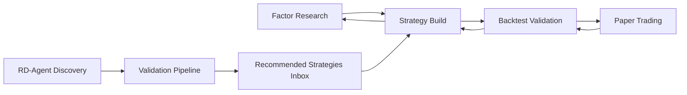

# QuantMate Workbench Workflow Implementation Plan

> **Status**: Draft · **Priority**: P0/P1  
> **Created**: 2026-05-22 · **Author**: QuantMate Team  
> **Source Documents**:  
> - `specs/product/PRD_PHASE1_WORKFLOW_CLOSURE_V1.md`  
> - `specs/product/PRD_PHASE2_AI_DEEP_INTEGRATION_V1.md`  
> - `specs/product/QUANTMATE_DUAL_PATH_STRATEGY_ANALYSIS_V1.md`  
> - `prototype/workbench.html` and related prototype pages  
> **Related Plans**:  
> - `development/plan/FACTOR_QLIB_INTEGRATION_PLAN.md`  
> - `development/plan/PAPER_TRADING_PLAN.md`  
> - `development/plan/COMPOSITE_STRATEGY_PLAN.md`

---

## 1. Overview

This document converts the current prototype direction and Phase 1 / Phase 2 PRDs into a production implementation plan.

The core product decision is:

1. Build a new **Workbench** as the primary workflow entry for Path 1.
2. Reuse existing Factor Lab, Strategies, Backtest, Paper Trading, and AI Assistant capabilities instead of rewriting them.
3. Treat the current standalone pages as **expert surfaces**, while Workbench becomes the guided surface.
4. Deliver **workflow closure first**, then deliver **deep AI integration**, then deliver **advanced orchestration and multi-agent autonomy**.

This plan deliberately separates:

- **Phase 1 delivery**: Factor -> Strategy -> Backtest -> Paper Trading closed loop
- **Phase 2 delivery**: visual builder, NL strategy generation, AI optimization, and AutoPilot 2.0
- **advanced architecture**: composite strategies, portfolio-level orchestration, and autonomous iteration

---

## 2. Objectives And Scope

### 2.1 Primary Objectives

#### P0 Objectives

- Launch `/workbench` as the unified workflow entry.
- Persist workflow state across refresh, return visits, and stage rollback.
- Embed a context-aware Copilot into the workflow.
- Enable one-click handoff across Factor Research, Strategy Build, Backtest, and Paper Trading.
- Generate AI backtest interpretation reports asynchronously and attach them to each backtest.

#### P1 Objectives

- Enable RD-Agent discovered factors to enter an automated validation pipeline.
- Turn validated AI output into importable strategy candidates.
- Add operational telemetry for conversion, abandonment, and AI adoption.

#### P2 Objectives

- Add visual strategy builder and NL-to-strategy generation.
- Add AI-driven optimization suggestions and application actions.
- Add AutoPilot 2.0 multi-agent research loops.

### 2.2 Out Of Scope For V1

- Full real-trading orchestration from Workbench
- RL-driven adaptive optimization
- Complete replacement of existing expert pages
- Full composite strategy orchestration as a Phase 1 dependency
- Large-scale portfolio allocator redesign as a Workbench blocker

---

## 3. Current Baseline

### 3.1 Current Product And Code Baseline

| Capability | Current Production Surface | Current State | Target Gap |
|-----------|----------------------------|---------------|------------|
| Unified Workbench | None | No route, no session model, no shared workflow shell | Must be added as a new product surface |
| Factor Research | `quantmate-portal/src/pages/FactorLab.tsx` | Factor CRUD, evaluation, mining, combine UI exist | Needs guided selection mode and Workbench embedding |
| Strategy Build | `quantmate-portal/src/pages/Strategies.tsx` | Mature CRUD, template, code editing, history | Needs workflow-driven draft mode and stage-aware entry |
| Multi-factor bridge | `quantmate/app/api/routes/strategies.py` + `multi_factor_engine.py` | Code generation and strategy creation already exist | Must be wrapped as Workbench stage actions |
| Backtest | `quantmate-portal/src/pages/Backtest.tsx` + queue APIs | Async jobs, bulk jobs, result viewing already exist | Needs session-linked launch, result summary, AI report, deployment bridge |
| Paper Trading | `quantmate-portal/src/pages/PaperTrading.tsx` and account detail page | Accounts and deployment surfaces already exist | Needs backtest-linked deploy flow and runtime cards in Workbench |
| AI Assistant | `quantmate-portal/src/pages/AIAssistant.tsx` | Standalone conversation UI | Must become context-aware Copilot inside Workbench |
| Composite Strategies | route and types exist | Separate advanced surface exists | Keep as advanced branch, not a Phase 1 blocker |

### 3.2 Main Gaps

| Gap | Current Situation | Impact |
|-----|-------------------|--------|
| Workflow fragmentation | Users still move manually across multiple routes | High drop-off and context loss |
| No persistent workflow state | No server-side session or artifact recovery | Refresh and revisit break continuity |
| AI not context-aware | AI is isolated as a standalone chat page | Low workflow value and low adoption |
| No formal handoff contract | Factors, strategy drafts, backtests, deployments are not linked by one workflow object | Hard to trace and automate |
| Backtest interpretation missing | Metrics exist, but readable AI guidance is absent | Weak decision support |
| RD-Agent disconnected | Discovery does not automatically trigger validation and strategy synthesis | No Path 2 closure |

### 3.3 Key Dependencies To Revalidate

Before implementation starts, the team should revalidate these assumptions in the current codebase and staging environment:

1. Factor evaluation accuracy and whether any remaining stub logic is still present.
2. Paper Trading runtime fidelity, especially price, PnL, and deployment status consistency.
3. Backtest result normalization across vnpy and Qlib paths.
4. Existing AI endpoints' suitability for embedding as a contextual Copilot.

---

## 4. Target Experience

### 4.1 Primary Information Architecture

The product should expose two layers:

- **Guided layer**: Workbench for end-to-end workflow completion
- **Expert layer**: Factor Lab, Strategies, Backtest, Paper Trading, Composite Strategies, AI Assistant

Workbench becomes the default entry for strategy research, while expert pages remain accessible for deep editing and advanced operations.

### 4.2 Phase 1 Workflow Model



### 4.3 Workbench Layout

The Workbench layout should follow the prototype direction:

- Left: stage-specific operation panel
- Right top: context-aware Copilot
- Right bottom: stage output preview

### 4.4 Stage Responsibilities

| Stage | User Goal | Required Capability |
|------|-----------|---------------------|
| Factor Research | select 1-N candidate factors | factor list, quick metrics, AI recommendations, shortlist |
| Strategy Build | create a runnable strategy draft | strategy type switch, parameter form, code generation, code preview, save |
| Backtest Validation | validate quality quickly | submit async backtest, poll progress, show summary metrics, show AI report |
| Paper Trading | deploy approved strategy to runtime | select account, choose mode, create deployment, show runtime card |

---

## 5. Target Architecture

### 5.1 Delivery Principles

1. **Reuse before rewrite**: Workbench orchestrates existing capabilities rather than replacing them.
2. **Single workflow object**: all cross-stage handoff data must belong to one persisted session.
3. **Stage-local validation**: each stage owns its guardrails and transition checks.
4. **Async by default**: heavy AI, factor, and backtest work must go through queues.
5. **Expert page parity**: Workbench and existing pages must share the same domain services and APIs.

### 5.2 Core Domain Model

#### 5.2.1 Workbench Session

Proposed table: `workbench_sessions`

| Column | Type | Notes |
|--------|------|-------|
| `id` | PK | session id |
| `user_id` | INT | owner |
| `name` | VARCHAR | default from strategy or factor selection |
| `status` | ENUM | `draft`, `running_backtest`, `paper_active`, `archived` |
| `current_stage` | ENUM | `factor`, `strategy`, `backtest`, `paper_trade` |
| `state_json` | JSON | canonical workflow state |
| `last_backtest_job_id` | VARCHAR | latest backtest binding |
| `last_deployment_id` | INT | latest paper deployment binding |
| `created_at` | TIMESTAMP | audit |
| `updated_at` | TIMESTAMP | audit |

#### 5.2.2 Workbench Session Events

Proposed table: `workbench_session_events`

| Column | Type | Notes |
|--------|------|-------|
| `id` | PK | event id |
| `session_id` | INT | parent session |
| `event_type` | VARCHAR | `factor_selected`, `strategy_saved`, `backtest_submitted`, `paper_deployed`, etc. |
| `payload` | JSON | event snapshot |
| `created_at` | TIMESTAMP | audit trail |

#### 5.2.3 AI Backtest Reports

Proposed table: `ai_backtest_reports`

| Column | Type | Notes |
|--------|------|-------|
| `id` | PK | report id |
| `user_id` | INT | owner |
| `job_id` | VARCHAR | backtest job binding |
| `status` | ENUM | `queued`, `running`, `completed`, `failed` |
| `report_json` | JSON | structured report sections and suggestions |
| `created_at` | TIMESTAMP | audit |
| `completed_at` | TIMESTAMP | audit |

### 5.3 Canonical Workflow State Contract

```json
{
  "stage": "strategy",
  "selected_factors": [
    {
      "id": 12,
      "name": "momentum_20d",
      "expression": "close/delay(close,20)-1",
      "ic_mean": 0.041,
      "ic_ir": 0.53
    }
  ],
  "strategy_draft": {
    "type": "cta",
    "name": "Momentum_Quality_Strategy_20260522",
    "class_name": "MomentumQualityStrategy",
    "params": {},
    "code": "...",
    "strategy_id": null
  },
  "backtest": {
    "job_id": null,
    "status": null,
    "summary": null,
    "ai_report_id": null
  },
  "paper_trade": {
    "account_id": null,
    "mode": null,
    "deployment_id": null,
    "runtime_summary": null
  }
}
```

### 5.4 API Plan

#### New APIs

| Endpoint | Purpose |
|----------|---------|
| `GET /api/v1/workbench/sessions` | list recent sessions |
| `POST /api/v1/workbench/sessions` | create new workflow session |
| `GET /api/v1/workbench/sessions/{id}` | load session state |
| `PUT /api/v1/workbench/sessions/{id}` | persist state snapshot |
| `POST /api/v1/workbench/sessions/{id}/transition` | validate and advance stage |
| `POST /api/v1/workbench/sessions/{id}/copilot/context` | build stage-aware context payload |
| `POST /api/v1/workbench/sessions/{id}/copilot/message` | contextual Copilot interaction |
| `POST /api/v1/backtests/{job_id}/ai-report` | generate or regenerate AI report |
| `GET /api/v1/backtests/{job_id}/ai-report` | fetch structured AI report |
| `POST /api/v1/rdagent/validation-runs` | start automated validation pipeline |

#### Existing APIs To Reuse

| Existing Surface | Usage In Workbench |
|------------------|--------------------|
| `/strategies/multi-factor/generate-code` | strategy draft code generation |
| `/strategies/multi-factor/create` | save strategy from selected factors |
| factor list/evaluation/mining APIs | factor discovery and quick review |
| queue backtest submit/list APIs | launch and track backtest |
| paper account and paper deployment APIs | deploy and monitor paper trading |

---

## 6. Workstreams

### 6.1 Frontend Workstream

#### Goals

- Add a new Workbench route and shell.
- Embed stage experiences while reusing existing domain UI and API contracts.
- Preserve expert routes as separate advanced surfaces.

#### Main Tasks

1. Add `Workbench.tsx` page and route.
2. Add a dedicated store or hook for workflow state and optimistic persistence.
3. Add stage components:
   - pipeline header
   - factor selection panel
   - strategy build panel
   - backtest validation panel
   - paper trading panel
4. Add right rail components:
   - Copilot panel
   - artifact preview panel
5. Add session restore, new workflow, and recent history interactions.
6. Add unified toasts, transition guards, and stage rollback UX.

#### Reuse Targets

- Factor list and evaluation logic from `FactorLab.tsx`
- strategy code and save flows from `Strategies.tsx`
- backtest forms and results from `Backtest.tsx`
- paper account and deployment flows from `PaperTrading.tsx` and the account detail page

### 6.2 Backend Workflow Workstream

#### Goals

- Make workflow state a first-class backend concept.
- Normalize transitions and artifact bindings.

#### Main Tasks

1. Add `workbench` domain package with service and DAO.
2. Add new session and event migrations.
3. Add transition validation rules:
   - factor -> strategy requires at least one factor
   - strategy -> backtest requires saved or draft-ready strategy
   - backtest -> paper requires successful backtest summary
4. Bind backtest jobs and paper deployments back to the originating session.
5. Add recent-session query and session restore APIs.

### 6.3 Strategy And Factor Workstream

#### Goals

- Support Workbench as a thin orchestrator over factor and strategy domains.
- Keep both CTA and Qlib research paths available.

#### Main Tasks

1. Add Workbench-focused factor selection payloads and light summary responses.
2. Add strategy draft generation path using the existing multi-factor engine.
3. Add Qlib strategy draft support where Phase 1 requires it.
4. Ensure strategy drafts can be saved without forcing users into the full Strategies page.
5. Link saved strategies to originating session ids.

### 6.4 Backtest And AI Report Workstream

#### Goals

- Make backtest results actionable, not just visible.
- Add AI interpretation as an async companion artifact.

#### Main Tasks

1. Normalize backtest summary payload for Workbench consumption.
2. Add queue task for AI report generation triggered on completed backtest.
3. Generate report sections required by PRD:
   - overall assessment
   - risk analysis
   - overfitting assessment
   - trading behavior analysis
   - optimization suggestions
   - market suitability
4. Add suggestion actions with optional "apply" operations for safe modifications.
5. Make historical AI reports queryable per backtest.

### 6.5 Paper Trading Workstream

#### Goals

- Make paper deployment a direct continuation of backtest approval.
- Preserve traceability from paper runtime back to the original workflow.

#### Main Tasks

1. Add deploy-from-backtest contract.
2. Prefill account, symbol, mode, and risk defaults from backtest context.
3. Return a runtime summary card suitable for Workbench Stage 4.
4. Add stop and detail actions from Workbench.
5. Ensure deployment records carry source session id, source backtest job id, and source strategy id.

### 6.6 RD-Agent Validation Workstream

#### Goals

- Close Path 2 without blocking Workbench MVP.
- Turn factor discovery into validated recommendations.

#### Main Tasks

1. Emit `factor_discovered` or equivalent event from RD-Agent flow.
2. Start automated validation pipeline:
   - factor evaluation
   - threshold filtering
   - factor grouping
   - strategy generation
   - batch backtest
   - ranking and summarization
3. Add inbox or recommendation list for validated outputs.
4. Add one-click import into Workbench Strategy stage or strategy library.

### 6.7 Telemetry And Analytics Workstream

Track at minimum:

- Workbench entry count
- stage transition rate
- abandonment by stage
- factor-to-strategy conversion
- backtest-to-paper conversion
- Copilot usage rate
- AI suggestion apply rate
- RD-Agent validation throughput

---

## 7. Milestone Plan

### 7.1 Team Assumption

Recommended working team:

- 2 frontend engineers
- 2 backend engineers
- 1 AI / worker / data engineer
- 1 QA / automation engineer

### 7.2 Milestones

| Milestone | Duration | Focus | Main Deliverables | Exit Criteria |
|-----------|----------|-------|-------------------|---------------|
| M0 | 1 week | Baseline and contracts | session model, API contracts, migration plan, feature flags | architecture approved, schema frozen |
| M1 | 2 weeks | Workbench shell | `/workbench`, session persistence, history, stage shell, preview rail | factor stage and strategy stage available end-to-end |
| M2 | 2 weeks | Strategy build closure | code generation, save strategy, rollback flow, expert page handoff | user can select factors and save strategy inside Workbench |
| M3 | 2 weeks | Backtest closure | submit backtest, status polling, summary rendering, AI report queue | user can backtest inside Workbench and receive report |
| M4 | 2 weeks | Paper deploy closure | deploy-from-backtest, runtime card, stop/detail actions | user can deploy approved strategy to paper from Workbench |
| M5 | 3 weeks | RD-Agent validation | event trigger, validation pipeline, ranked recommendations, import | discovered factors can become recommended strategy candidates |
| M6 | 4-6 weeks | Phase 2 builder | visual builder, NL strategy generation, component registry | advanced build modes available in strategy stage |
| M7 | 4-6 weeks | AutoPilot 2.0 | orchestrator, multi-agent research, shared memory, reports | autonomous research loop available for controlled rollout |

### 7.3 Recommended Release Slices

#### Release V1

- M0 through M4
- Path 1 closed loop only
- Workbench launched behind feature flag, then enabled for internal and staging users

#### Release V2

- M5 through M6
- RD-Agent validation and advanced strategy creation modes

#### Release V3

- M7
- AutoPilot 2.0 and deeper AI autonomy

---

## 8. Repository-Level Implementation Map

### 8.1 Frontend Files

#### New Files

- `quantmate-portal/src/pages/Workbench.tsx`
- `quantmate-portal/src/components/workbench/StagePipeline.tsx`
- `quantmate-portal/src/components/workbench/FactorStage.tsx`
- `quantmate-portal/src/components/workbench/StrategyStage.tsx`
- `quantmate-portal/src/components/workbench/BacktestStage.tsx`
- `quantmate-portal/src/components/workbench/PaperTradeStage.tsx`
- `quantmate-portal/src/components/workbench/CopilotPanel.tsx`
- `quantmate-portal/src/components/workbench/ArtifactPreview.tsx`
- `quantmate-portal/src/stores/workbench.ts` or `src/hooks/useWorkbenchSession.ts`

#### Files To Modify

- `quantmate-portal/src/App.tsx`
- `quantmate-portal/src/lib/api.ts`
- `quantmate-portal/src/types/index.ts`
- `quantmate-portal/src/pages/FactorLab.tsx`
- `quantmate-portal/src/pages/Strategies.tsx`
- `quantmate-portal/src/pages/Backtest.tsx`
- `quantmate-portal/src/pages/PaperTrading.tsx`
- `quantmate-portal/src/pages/PaperTradingAccount.tsx`
- `quantmate-portal/src/pages/AIAssistant.tsx` or shared AI support modules

### 8.2 Backend Files

#### New Files

- `quantmate/app/api/routes/workbench.py`
- `quantmate/app/api/models/workbench.py`
- `quantmate/app/domains/workbench/service.py`
- `quantmate/app/domains/workbench/dao/workbench_session_dao.py`
- `quantmate/app/domains/ai/backtest_report_service.py`
- `quantmate/app/worker/service/ai_tasks.py`
- `quantmate/mysql/migrations/0XX_create_workbench_sessions.sql`
- `quantmate/mysql/migrations/0XX_create_ai_backtest_reports.sql`

#### Files To Modify

- `quantmate/app/api/main.py`
- `quantmate/app/api/routes/strategies.py`
- `quantmate/app/api/routes/queue.py`
- `quantmate/app/api/routes/paper_trading.py`
- `quantmate/app/api/routes/ai.py` or equivalent AI routes
- `quantmate/app/worker/service/qlib_tasks.py`
- factor-domain services used by Workbench shortlist and recommendation flows

### 8.3 Related Plans To Integrate Instead Of Rewriting

| Existing Plan | How It Fits This Plan |
|---------------|-----------------------|
| `FACTOR_QLIB_INTEGRATION_PLAN.md` | supplies reliable factor evaluation, mining, and factor-to-strategy bridge capabilities |
| `PAPER_TRADING_PLAN.md` | supplies account, deploy, runtime, and simulation fidelity requirements for Stage 4 |
| `COMPOSITE_STRATEGY_PLAN.md` | becomes the advanced Phase 2+ branch for composite and orchestration-heavy workflows |

---

## 9. Acceptance Strategy

### 9.1 PRD Traceability

| PRD Area | Covered By |
|----------|------------|
| PRD-1 Workbench | M0-M4 |
| PRD-2 Context-aware Copilot | M1-M4 |
| PRD-3 One-click handoff | M2-M4 |
| PRD-4 AI backtest interpretation | M3 |
| PRD-5 RD-Agent validation pipeline | M5 |
| PRD-6 Visual builder and NL generation | M6 |
| PRD-7 AutoPilot 2.0 | M7 |
| PRD-8 AI optimization | M6-M7 |
| PRD-9 factor research enhancement | M5-M6 |

### 9.2 Test Layers

#### Unit Tests

- session transition validation
- state serialization and recovery
- Copilot context builder
- AI report section generator
- deploy-from-backtest payload builder

#### Integration Tests

- factor select -> strategy draft -> save strategy
- strategy save -> backtest submit -> result binding
- backtest complete -> AI report generation
- backtest approve -> paper deployment
- RD-Agent factor discovery -> validation pipeline -> recommendation list

#### E2E Tests

1. User opens Workbench, selects 2 factors, generates strategy, saves, launches backtest, deploys to paper.
2. User refreshes during stage 2 or 3 and resumes without data loss.
3. User applies an AI suggestion from a backtest report and re-runs validation.
4. User imports one validated RD-Agent recommendation into the strategy stage.

### 9.3 Operational Acceptance Targets

- Workbench state restore success rate >= 99%
- backtest status poll interval <= 3 seconds
- AI report generation time <= 30 seconds after backtest completion
- zero broken traceability between session, strategy, backtest, and deployment records

---

## 10. Risks And Mitigations

| Risk | Impact | Mitigation |
|------|--------|------------|
| Factor metrics are not yet fully reliable | weak factor selection and invalid recommendations | gate Workbench rollout behind factor metric verification |
| Paper Trading runtime data is not trustworthy enough | false user confidence after deployment | treat Stage 4 fidelity as a hard dependency gate |
| Workbench duplicates expert-page logic | maintenance burden and regression risk | reuse shared domain APIs and shared React components |
| AI latency or cost spikes | poor UX and high inference spend | queue heavy tasks, cache structured reports, limit auto-generation scope |
| vnpy and Qlib result contracts diverge | inconsistent AI interpretation and preview rendering | normalize result schema before Workbench consumption |
| Composite strategy scope expands too early | delays V1 launch | keep composite flows out of Phase 1 critical path |

---

## 11. Release Strategy

### 11.1 Feature Flag Plan

- `workbench.enabled`
- `workbench.copilot.enabled`
- `backtest.ai_report.enabled`
- `rdagent.validation_pipeline.enabled`
- `workbench.visual_builder.enabled`
- `workbench.nl_strategy.enabled`

### 11.2 Rollout Sequence

1. internal development accounts
2. staging environment
3. limited pilot users
4. default entry recommendation from dashboard and navigation

### 11.3 Rollback Plan

If Workbench fails validation or introduces blocking regressions:

- disable the feature flag
- keep expert pages fully usable
- preserve saved sessions and reports for later recovery

---

## 12. Recommended Decision Gates

The following decisions should be explicitly resolved before M1 starts:

1. Should Phase 1 support both CTA and Qlib strategy drafts, or CTA only for the first launch?
2. Should AI report generation be automatic for every completed backtest, or only for Workbench-launched backtests?
3. Should RD-Agent recommendations land in Workbench directly, AutoPilot directly, or both?
4. Should Composite Strategies remain a separate route in V1, or appear as an advanced branch inside the Strategy stage?

### Recommended Answers

1. **CTA first, Qlib second** for Workbench launch; keep Qlib available via expert routes until summary contracts are stable.
2. **Automatic for Workbench-launched backtests first**, then expand to all completed backtests.
3. **Both, but with one storage source**: one recommendation store, rendered in Workbench and AutoPilot.
4. **Separate route in V1**; integrate as an advanced branch only after the basic closed loop is stable.

---

## 13. Final Recommendation

The recommended execution order is:

1. ship Workbench as a thin orchestration layer over existing capabilities
2. formalize session persistence and traceability before expanding AI features
3. add AI report generation and deploy handoff before visual builder and NL creation
4. treat RD-Agent validation as the first Path 2 milestone
5. delay composite orchestration and AutoPilot 2.0 until the manual path is operationally stable

This sequence gives QuantMate the fastest path to measurable workflow closure while preserving architectural room for deeper AI integration.